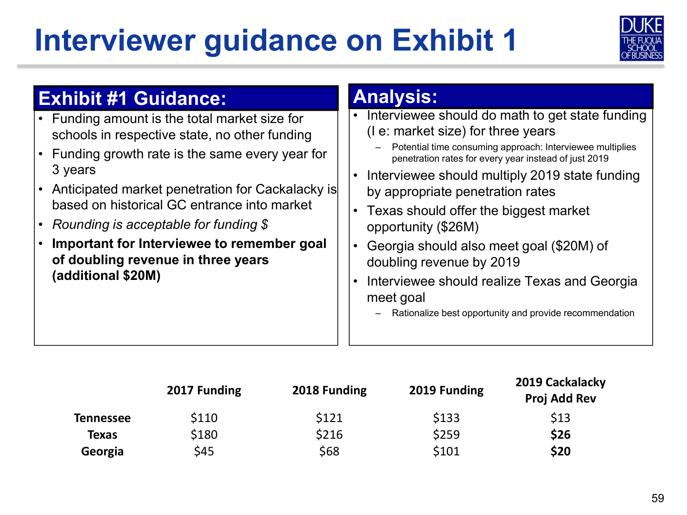
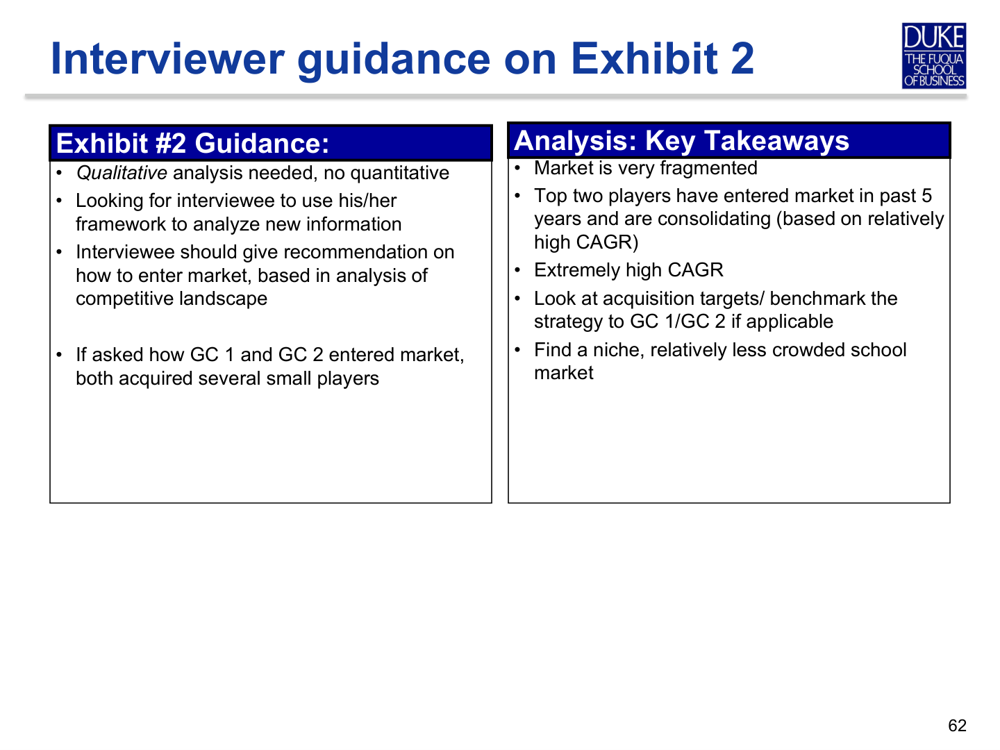

# Cackalacky Construction

---

## Source page 30

**Block type guess:** `text`

### Extracted text

Cackalacky Construction

Industry: Infrastructure Quantitative Level: Easy Qualitative Level: Medium

---

## Source page 31

**Block type guess:** `prompt`

### Extracted text

Prompt #1:
• Cackalacky Construction is a small general contractor in the southeast US. They build schools exclusively. In 2016 Cackalacky generated $20M in revenue, but they have seen stagnant growth in recent years. Cackalacky Construction is looking to double their revenue in the next 3 years and has hired you to advise them how to do it.

Interviewer Guidance:
• General contractors are responsible for all building activities but not design or engineering. They supervise subcontractors who perform physical construction work
• Cackalacky clients are local governments that receive federal and state funding to build schools; Cackalacky only builds public schools and there aren’t any private clients
• Cackalacky Construction has been in the southeast US for 20 years
• Contractors who build schools in this region are facing similar problems

• Next step: The discussion on the initial framework should lead to analyzing potential markets to enter. Handover Exhibit # 1 at that point

---

## Source page 32

**Block type guess:** `text`

### Extracted text

Exhibit #1: Potential Markets

2016 School Construction Funding ($M)

Pop Growth

1. School construction funding 2. Low = 5%; Med = 10%; High = 20%

Anticipated 3

Literacy

Projected YoY Funding Growth1

YR Market Penetration2

Rate

Major Industry

Michigan 100 4% Automotives 87% 10% Med

Texas 150 6% Oil & Gas 81% 20% Med

Georgia 30 2% Tourism 73% 50% High

### Extracted real tables

#### table_1

|  | 2016 School
Construction
Funding ($M) | Pop
Growth | Major
Industry | Literacy
Rate | Projected YoY
Funding Growth1 | Anticipated 3
YR Market
Penetration2 |
| --- | --- | --- | --- | --- | --- | --- |
| Michigan | 100 | 4% | Automotives | 87% | 10% | Med |
| Texas | 150 | 6% | Oil & Gas | 81% | 20% | Med |
| Georgia | 30 | 2% | Tourism | 73% | 50% | High |

---

## Source page 33

**Block type guess:** `text`

### Page Snapshot

### Extracted text

Interviewer guidance on Exhibit 1

Exhibit #1 Guidance:
Analysis:

• Interviewee should do math to get state funding (I e: market size) for three years

• Funding amount is the total market size for schools in respective state, no other funding
• Funding growth rate is the same every year for 3 years
• Anticipated market penetration for Cackalacky is based on historical GC entrance into market
• Rounding is acceptable for funding $
• Important for Interviewee to remember goal of doubling revenue in three years (additional $20M)

– Potential time consuming approach: Interviewee multiplies penetration rates for every year instead of just 2019
• Interviewee should multiply 2019 state funding by appropriate penetration rates
• Texas should offer the biggest market opportunity ($26M)
• Georgia should also meet goal ($20M) of doubling revenue by 2019
• Interviewee should realize Texas and Georgia meet goal
– Rationalize best opportunity and provide recommendation

2017 Funding 2018 Funding 2019 Funding 2019 Cackalacky

Proj Add Rev Tennessee $110 $121 $133 $13 Texas $180 $216 $259 $26 Georgia $45 $68 $101 $20

---

## Source page 34

**Block type guess:** `prompt`

### Extracted text

Prompt #2:
• Cackalacky Construction has decided to enter the Texas market
• What are some of the considerations to enter? What is the best way to enter the market?

Interviewer Guidance:
• Interviewee needs a new framework; some form of Build, Borrow, Buy
• The consideration to enter will include understanding the market forces, including the competition. • When the discussion is around Competition, handover Exhibit # 2 and analyze the competitive landscape in Texas

---

## Source page 35

**Block type guess:** `text`

### Extracted text

Exhibit #2: Texas Competitive Landscape

2015 Revenue from school construction ($M) $100

$80

$60

$40

$28

$21

$20

$0

General Contractor 1

1.GCs with less than 5% of market 2. Number of years general contractor has been building in Texas

$92

$9

All Other1 General Contractor 3 General Contractor 2

Market Share 19% 14% 6% 61% School Specialty Community College K-12 K-12 All types Years in Texas2 3 5 14 1-40 years CAGR 23% 35% 6% 12%

### Extracted real tables

#### table_1

| 0 | 1 | 2 | 3 | 4 |
| --- | --- | --- | --- | --- |
| Market Share | 19% | 14% | 6% | 61% |
| School Specialty | Community College | K-12 | K-12 | All types |
| Years inTexas2 | 3 | 5 | 14 | 1-40 years |
| CAGR | 23% | 35% | 6% | 12% |

---

## Source page 36

**Block type guess:** `text`

### Page Snapshot

### Extracted text

Interviewer guidance on Exhibit 2

Exhibit #2 Guidance:
Analysis: Key Takeaways

• Market is very fragmented
• Top two players have entered market in past 5 years and are consolidating (based on relatively high CAGR)
• Extremely high CAGR
• Look at acquisition targets/ benchmark the strategy to GC 1/GC 2 if applicable
• Find a niche, relatively less crowded school market

• Qualitative analysis needed, no quantitative
• Looking for interviewee to use his/her framework to analyze new information
• Interviewee should give recommendation on how to enter market, based in analysis of competitive landscape

• If asked how GC 1 and GC 2 entered market, both acquired several small players

---

## Source page 37

**Block type guess:** `prompt`

### Extracted text

Prompt #3:
• What are the potential challenges Cackalacky Construction will face as they enter the Texas market?

• What are ways to mitigate some of these challenges?

• What is the final recommendation ?

Interviewer Guidance:
• Examples of potential challenges: personnel, legal and regulatory environment, labor unions (don't exist in Texas), industry relationships, IT integration, language, corporate culture
• List down different ways of entering the market with pros and cons of each with a recommendation to evaluate each one of them

