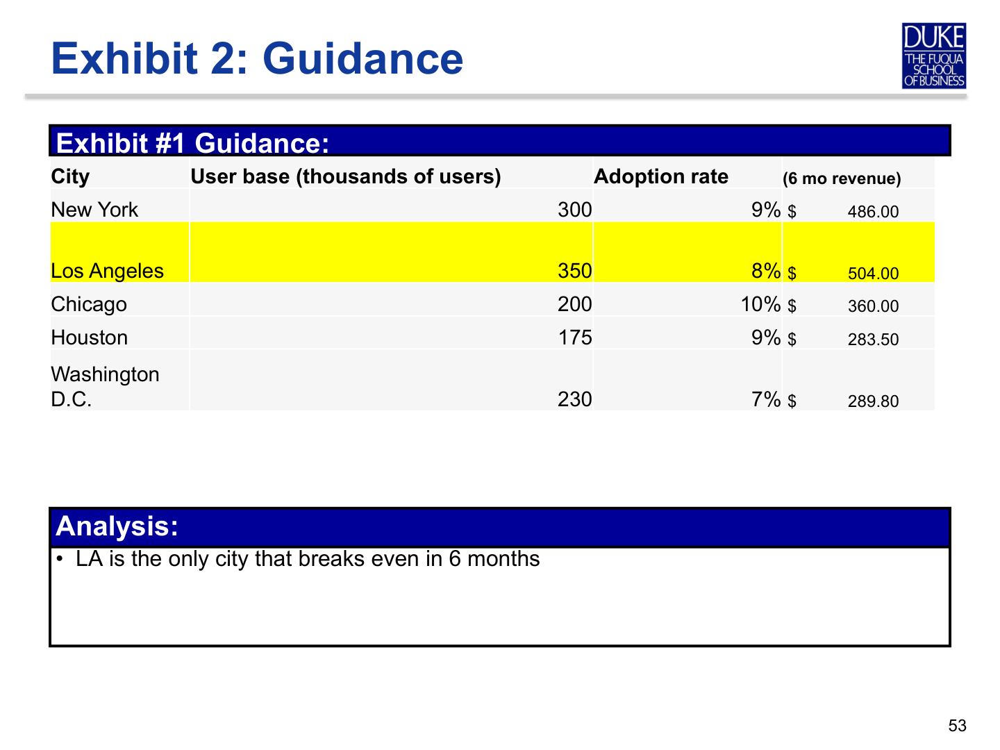

# Swipe Right for Canoodle

---

## Source page 21

**Block type guess:** `text`

### Extracted text

Swipe Right for Canoodle

Industry:
Technology Quantitative Level: Easy Qualitative Level: Medium

---

## Source page 22

**Block type guess:** `prompt`

### Extracted text

Prompt #1:
• Your client is Canoodle, a revolutionary mobile dating service which utilizes swipe technology allowing users to easily select mates based on their online profiles. Canoodle was started 2 years ago and now operates across the United States. Despite its success and mass popularity, Canoodle has remained unprofitable, and investors are starting to put pressure on the CEO, Stevie McDreamy, to turn the business around. McDreamy has come to you to help out Canoodle. What should they do?

Interviewer Guidance:
• Canoodle only operates within the United States with ambitions to expand internationally
• The app is free to download off all mobile application stores. Canoodle’s main source of revenue so far has been through ad sales
• The company must show a profit within 2 years
• Canoodle is already an LGBT friendly dating app and caters to the sexual orientation of all its users
• The market for dating applications consists of ~4 major national competitors. Most users typically have 1-3 dating apps, and all 4 competitors have roughly the same number of users within the United States
• Canoodle does not consider traditional online dating websites in the same market

---

## Source page 23

**Block type guess:** `text`

### Extracted text

Exhibit #1: Canoodle’s Previous Performance

1,500 1,400 1,300 1,200 1,100 1,000 900 800 700 600 500 400 300 200 100 0

Revenue ($ 000’s) User Base (000’s) Total Expenses ($ 000’s)

3QFY2014 4QFY2014 1QFY2015 2QFY2015 3QFY2015 4QFY2015 1QFY2014 2QFY2014

---

## Source page 24

**Block type guess:** `text`

### Page Snapshot

### Extracted text

Exhibit #1: Explanation

Interviewer Guidance:
• Interviewee should pick up on the fact that revenues have fallen with the slower growth in the user base. Additionally, costs have stabilized. This is a Revenue problem
• Ask Candidate to brainstorm sources of revenue:
– Selling user demographic data (risk of potential privacy issues)
– Selling outside services (i.e. emojis/stickers)
– Selling a premium upgrade to its users
– Charging on the application store

---

## Source page 25

**Block type guess:** `prompt`

### Extracted text

Prompt #2:
• Upon hearing your suggestions, McDreamy is inclined to pursue a “premium” service for consumers to use. The development teams estimates costs at $500,000 and would take 6 months to develop. What factors should McDreamy consider before committing to the investment?

Interviewer Guidance:
• Candidate should pick up on difficulties entering new market:
– Price
– Market size
– Adoption rate
– Marketing
• Bonus points if they pick up on the following:
– Customer churn/impacts on current customer base
– Transaction costs
– Implementation timeline and competitive response

---

## Source page 26

**Block type guess:** `prompt`

### Extracted text

Prompt #3:
• Due to staff and server capacity issues, McDreamy has decided that he would like to launch in just one city this year before rolling out nationwide. Which city would be the best for CanoodlePremium to launch in?

Interviewer Guidance:
• Provide candidate with exhibit. If the candidate asks, the price for the premium service per month is $3. Candidate should know to ask what the price per month would be.
• McDreamy wants the initiative to breakeven within 6 months of launching

---

## Source page 27

**Block type guess:** `text`

### Extracted text

Exhibit #2: Projected performance of CanoodlePremium

City User base (thousands of users) Adoption rate

New York 300 9%

Los Angeles 350 8%

Chicago 200 10%

Houston 175 9%

Washington D.C. 230 7%

### Extracted real tables

#### table_1

| City | User base (thousands of users) | Adoption rate |
| --- | --- | --- |
| New York | 300 | 9% |
| Los Angeles | 350 | 8% |
| Chicago | 200 | 10% |
| Houston | 175 | 9% |
| Washington D.C. | 230 | 7% |

---

## Source page 28

**Block type guess:** `text`

### Page Snapshot

### Extracted text

Exhibit 2: Guidance

Exhibit #1 Guidance:
City User base (thousands of users) Adoption rate (6 mo revenue) New York 300 9% $ 486.00

Los Angeles 350 8% $ 504.00 Chicago 200 10% $ 360.00 Houston 175 9% $ 283.50 Washington D.C. 230 7% $ 289.80

Analysis:
• LA is the only city that breaks even in 6 months

### Extracted real tables

#### table_1

| 0 | 1 | 2 | 3 |
| --- | --- | --- | --- |
| Exhibit #1 Guidance: |  |  |  |
| City | User base (thousands of users) | Adoption rate | (6 mo revenue) |
| New York | 300 | 9% | $ 486.00 |
| Los Angeles | 350 | 8% | $ 504.00 |
| Chicago | 200 | 10% | $ 360.00 |
| Houston | 175 | 9% | $ 283.50 |
| Washington D.C. | 230 | 7% | $ 289.80 |

---

## Source page 29

**Block type guess:** `text`

### Extracted text

• Canoodle should launch a premium service in Los Angeles
Recommendation

Interviewer Guidance:
• Concerns:
– Sensitivity around adoption rate
– Risk of launching in one city versus all at once
– Extra maintenance costs for premium service
– Competitive response
• Next Steps
– Development (in house or contracted)

