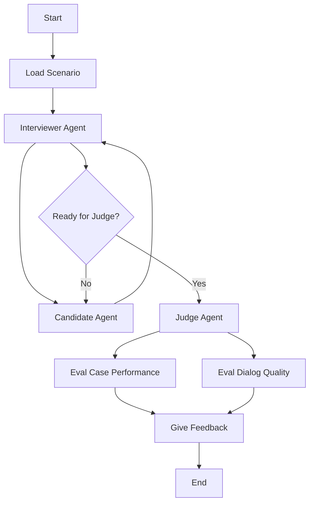
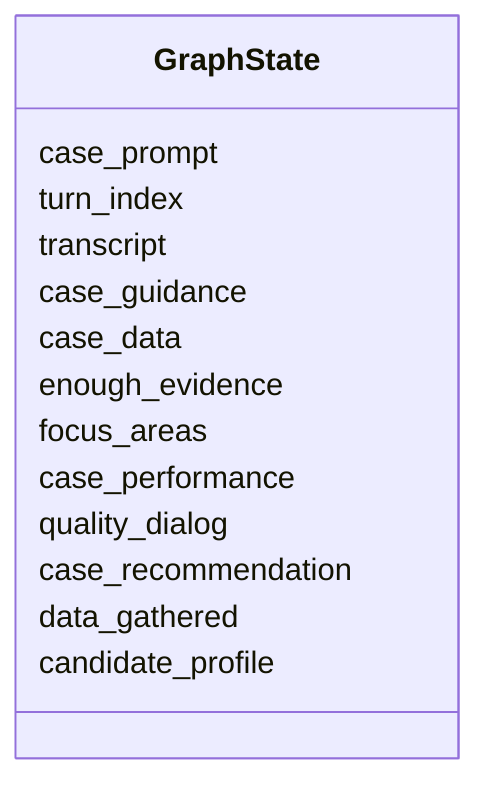
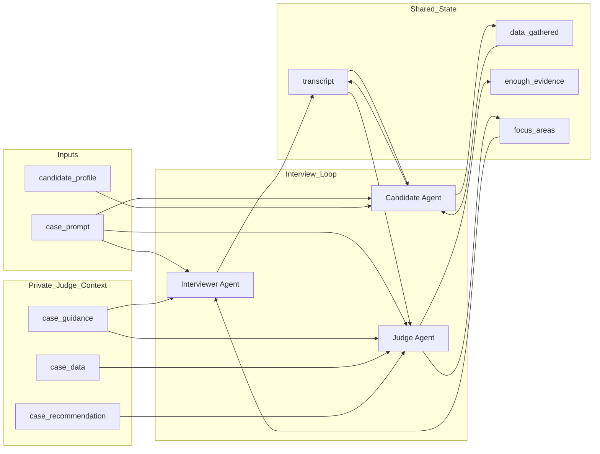
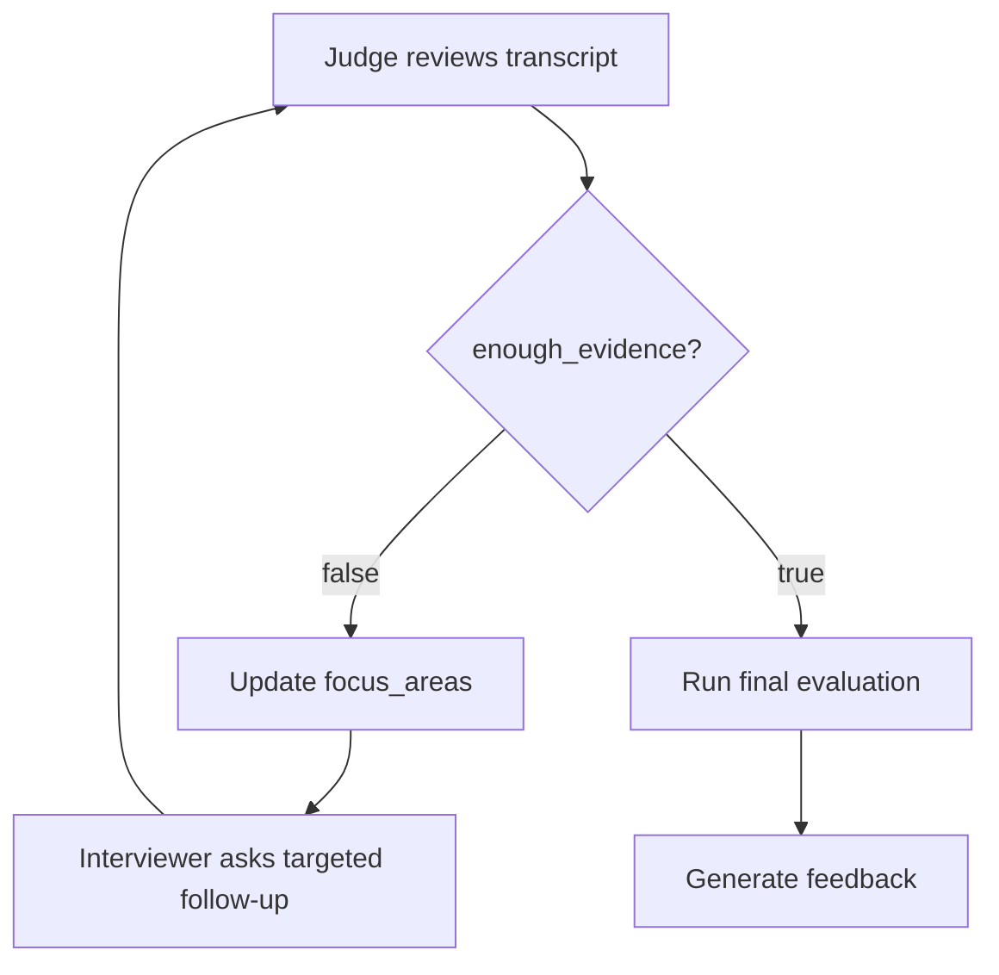

# Agentic Graph Design

This section describes the final graph used for the agentic consulting case interview system. The system is built as a controlled interview loop where the interviewer gathers evidence from the candidate, while the judge checks whether the conversation contains enough information to evaluate the candidate properly.

The design follows the project goal of comparing a single-agent baseline with a specialised agentic architecture, where the interviewer and judge have separate responsibilities instead of sharing one generic role. 

## Graph overview

The interview is organised as an adaptive loop between the Interviewer Agent and the Candidate Agent. The Interviewer Agent presents the case, asks follow-up questions, and decides whether the conversation should continue or whether the available transcript is ready to be evaluated.

After each candidate response, the Interviewer Agent updates the transcript and reviews the current state of the interview. If the candidate’s reasoning still needs clarification, the Interviewer Agent asks another question and the loop continues. This allows several interviewer-candidate turns to happen before the Judge Agent is involved.

The Judge Agent is only called once the Interviewer Agent decides that the interaction has produced enough evidence for evaluation, or that the interview should move towards assessment. At that point, the Judge Agent analyses the transcript, the case data, the case guidance, and the expected recommendation. It then evaluates the candidate’s case performance and dialogue quality.

## Agent roles

### Interviewer agent

The interviewer agent controls the visible interview. It presents the case, asks questions, reacts to the candidate's answers, and uses the judge's focus areas to decide what to explore next.

It does not produce the final evaluation. Its role is to collect useful evidence from the candidate.

### Candidate agent

The candidate agent represents the interview participant in controlled experiments. It receives the case prompt, the interviewer's visible messages, the public transcript, and its own running record of information already gathered from the interviewer.

It should not see the judge's private assessment, case guidance, expected answer, or internal focus areas.

### Judge agent

The judge agent evaluates the interview as it develops. It reads the case prompt, the transcript, the case guidance, the case data, and the expected recommendation. It decides whether the current evidence is enough to assess the candidate.

If the evidence is incomplete, the judge writes focus areas for the interviewer. If the evidence is sufficient, it allows the graph to move to final evaluation.

## State design

The graph state stores both the public interview information and the private evaluation information. This separation is important because the candidate should only see the conversation, while the interviewer and judge can use additional internal context.

## State fields

| Field | Purpose | Access |
|---|---|---|
| `case_prompt` | Initial case statement shown to the candidate. | Candidate, Interviewer, Judge |
| `turn_index` | Tracks the current interview turn. | Interviewer |
| `transcript` | Full interview conversation used for evaluation. | Candidate-visible version for candidate; full version for agents |
| `case_guidance` | Rubric and case-solving guidance used to steer evaluation and interviewing. | Interviewer, Judge |
| `case_data` | Case facts, exhibits, expected logic, and supporting information. | Interviewer, Judge |
| `enough_evidence` | Boolean decision on whether the transcript is sufficient for evaluation. | Judge writes; graph reads |
| `focus_areas` | Missing areas that the interviewer should explore next. | Judge writes; Interviewer reads |
| `case_performance` | Evaluation of the candidate's case-solving quality. | Judge / evaluation node |
| `quality_dialog` | Evaluation of communication, clarity, and interaction quality. | Judge / evaluation node |
| `case_recommendation` | Assessment of the final recommendation. | Judge / evaluation node |
| `data_gathered` | Candidate-side memory of information already gathered from the interviewer. | Candidate only |
| `candidate_profile` | Controlled candidate behaviour used for experiments. | Candidate setup; not part of judge reasoning unless explicitly needed |

## Read and write logic

## Control logic

The key decision point is `enough_evidence`.

When `enough_evidence = false`, the graph does not evaluate the candidate yet. The judge updates `focus_areas`, and the interviewer asks another follow-up question.

When `enough_evidence = true`, the graph stops the interview loop and moves to final evaluation.

## Final feedback

Final feedback is generated only after the interview loop has ended and the Judge Agent has completed the evaluation fields. The feedback is not based on a generic impression of the candidate. Instead, it is derived from the transcript and from the structured scores produced by the Judge Agent.

The Judge Agent evaluates the candidate using a 1–4 rubric across two groups of fields. The first group measures case performance, including the opening, structure, quantitative reasoning when applicable, creativity when applicable, final recommendation, overall structure, overall problem solving, and overall communication. The second group measures interaction quality, including clarity and concision, responsiveness, groundedness, confidence calibration, and multi-turn coherence.

Each field contains a score and a short rationale. Some fields can be marked as `not_tested` when the interview scenario does not provide enough evidence to evaluate that dimension. This prevents the system from forcing a score where the case did not actually test that skill.

The final feedback agent uses these structured fields to produce a concise feedback report. It summarises the candidate’s main strengths, identifies the most important weaknesses, and explains how the candidate could improve in future case interviews. The feedback must remain grounded in the transcript and in the Judge Agent’s rationales, rather than introducing new judgements that were not supported by the evaluation.
