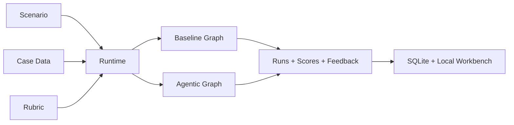

# Agentic Case Interview Coach


> **Under construction**
>
> This repository is an active research prototype and is still being cleaned up for public release.

`Agentic Case Interview Coach` is a dissertation project focused on AI-supported consulting case interview practice.

The current system simulates case interviews end to end, compares a `baseline` runtime against a more adaptive `agentic` runtime, stores the resulting traces, and exposes a small local workbench for inspection and human evaluation.

> A research prototype for testing whether a more agentic interview graph produces better coaching and evaluation than a simpler baseline.

## Why It Is Interesting

- It treats case interview practice as a graph design problem, not just a single prompt
- It compares two orchestration styles on the same scenarios and rubric
- It combines simulation, evaluation, retrieval, persistence, and human review in one workflow
- It is built as an experimental bench for dissertation work, not as a polished demo shell

## What This Project Does

- Simulates consulting case interviews from structured scenario data
- Compares two runtime designs: `baseline` and `agentic`
- Uses separate LLM-driven roles for interviewer, candidate, judge, and feedback
- Evaluates runs against a structured rubric
- Adds retrieval-backed guidance from consulting methodology sources
- Stores run artifacts in SQLite for later analysis
- Provides a local Flask dashboard to inspect runs and annotate them manually

## Project Status

This repository is being published as an academic/research codebase, not as a production-ready product.

Current status:

- core runtime is functional
- workbench UI is available for local inspection
- documentation is still being consolidated
- repository layout still includes archived experiments and research material
- APIs, prompts, and data assets may change without notice

## Stack

- Python 3.10+
- LangGraph
- LangChain
- Flask
- SQLite
- ChromaDB
- FastEmbed
- `pypdf`
- OpenAI-compatible LLM endpoints
- OpenRouter for the four active LLM roles (interviewer, candidate, judge, feedback)
- LM Studio wiring exists for local dev and connectivity tests, but the active `baseline`/`agentic` graphs run entirely on OpenRouter

## Repository Layout

```text
.
├── README.md
├── doc/                     # architecture notes, prompt docs, diagrams
├── src/
│   ├── main/
│   │   ├── studio/          # active LangGraph runtimes, prompts, RAG, persistence
│   │   ├── web/             # local workbench and inspection UI
│   │   ├── artifacts/       # generated run database and exports
│   │   └── database/        # vector stores and active data assets
│   ├── scenarios/           # scenario configs and rubric assets
│   ├── synthetic-dataset/   # synthetic case content used by the runtime
│   ├── schemas/             # shared JSON schemas
│   ├── Makefile
│   └── run_all_scenarios.py
└── archive/                 # legacy prototypes and research material
```

## Runtime Overview

The main comparison in this repository is between:

- `baseline`: a simpler interview loop with a fixed evaluation flow
- `agentic`: a more adaptive graph with interviewer decisions, judge checkpoints, and retrieval-backed feedback

Both runtimes operate on the same structured inputs:

1. a scenario
2. a case
3. a shared rubric

They then produce interview transcripts, evaluation outputs, and final coaching feedback.



## Main Components

- `Interviewer`: drives the case conversation and follow-up questions
- `Candidate`: simulates the interviewee from scenario instructions
- `Judge`: checks evidence quality and identifies missing focus areas
- `Feedback`: produces final coaching output
- `RAG layer`: injects methodology context from consulting guide sources
- `Workbench`: lets you inspect runs and add human evaluation

## Quick Start

Install the dependencies from [src/requirements.txt](src/requirements.txt) and run commands from `src/`.

Example:

```bash
cd src
python3 run_all_scenarios.py --graph both --limit 3
```

This writes persisted runs to `src/main/artifacts/runs.sqlite` and batch outputs to `src/main/artifacts/batch_runs/`.

To open the local workbench:

```bash
cd src
make workbench
```

Default URL:

```text
http://localhost:5020
```

## Environment

The runtime loads a repository-level `.env` file when present.

The `baseline` and `agentic` graphs call OpenRouter for all four roles:

```bash
OPENROUTER_API_KEY=sk-or-v1-...
OPENROUTER_MODEL_INTERVIEWER=meta-llama/llama-3.3-70b-instruct
OPENROUTER_MODEL_CANDIDATE=google/gemma-3-27b-it
OPENROUTER_MODEL_JUDGE=qwen/qwen-2.5-72b-instruct
OPENROUTER_MODEL_FEEDBACK=meta-llama/llama-3.3-70b-instruct
OPENROUTER_MODEL_BASELINE=meta-llama/llama-3.3-70b-instruct
WORKBENCH_PORT=5020
```

`OPENROUTER_MODEL_BASELINE` is the `baseline` graph's single fused model, pinned independently of `OPENROUTER_MODEL_JUDGE`.

`LMSTUDIO_*` variables are also read (used by the connectivity test and as a manual local fallback), but no active graph role is wired to them by default:

```bash
LMSTUDIO_BASE_URL=http://localhost:8081/v1
LMSTUDIO_MODEL=deepseek-r1-distill-llama-8b
LMSTUDIO_API_KEY=lm-studio
LMSTUDIO_TEMPERATURE=0.14
```

## Documentation

- [src/README.md](src/README.md): detailed runtime and development guide
- [RAG_GUIDE_PDF.md](RAG_GUIDE_PDF.md): notes on the PDF-based RAG layer
- [doc/summary_arch.md](doc/summary_arch.md): architecture summary
- [doc/graph.md](doc/graph.md): agentic graph design (interviewer/judge loop)
- [doc/model-selection.md](doc/model-selection.md): rationale for the LLMs used per role
- [doc/RAG.md](doc/RAG.md): retrieval design notes
- [doc/profitability-case.md](doc/profitability-case.md): shared schema and authoring template for profitability cases
- [doc/tests-overview.md](doc/tests-overview.md): overview of the test suite structure
- [doc/evaluation/agent-evaluation.md](doc/evaluation/agent-evaluation.md): judge and interviewer evaluation, agentic vs baseline
- [doc/evaluation/RAG-evaluation.md](doc/evaluation/RAG-evaluation.md): RAG evaluation framework
- [doc/prompts/](doc/prompts/): system prompts used by each role (interviewer, candidate, judge, feedback, baseline)
- [doc/Mindmaps/](doc/Mindmaps/): drawio diagrams for the graph and evaluation design

## Research And Publication Notes

- This repository is part of an academic dissertation workflow.
- It contains active prototype code, intermediate assets, and archived experiments.
- Some datasets, case materials, PDFs, or derived resources may originate from third-party sources and can carry their own usage restrictions.
- If you plan to reuse any non-code asset, verify its original source and license first.

## License

No open-source license has been added to this repository yet.

Unless and until a `LICENSE` file is added, this project should be treated as `all rights reserved`.

Code, datasets, prompts, and third-party source materials should not be assumed to be freely reusable.
