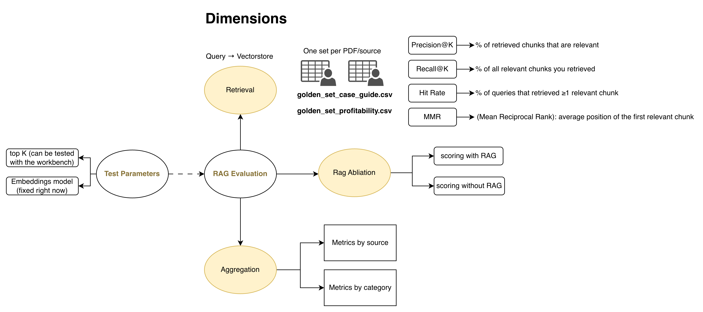

# RAG Evaluation Framework


## 1. Retrieval Evaluation

**Objective:** Assess the quality and relevance of chunks retrieved from the vector store in response to user queries.

### Metrics

The retrieval component is evaluated using the following key performance indicators:

- **Precision@K**: The percentage of retrieved chunks that are relevant to the query. Measures the accuracy of returned results.

- **Recall@K**: The percentage of all relevant chunks in the vector store that were successfully retrieved. Measures completeness of relevant results.

- **Hit Rate**: The percentage of queries for which at least one relevant chunk was retrieved (Hit Rate ≥ 1). Indicates the system's ability to find *any* relevant information.

- **Mean Reciprocal Rank (MRR)**: The average position of the first relevant chunk across all queries. Lower values indicate that relevant content is ranked higher in the retrieval results.

### Golden Dataset

Retrieval metrics are computed against the **generation golden sets**: `src/database/rag_evaluation/generation_golden_set_case_guide.csv` and `generation_golden_set_profitability.csv`.

**Required Columns:**
- `query_id`: Unique identifier for each query
- `query`: The user question or search query
- `answer`: The expected/ground truth answer
- `source_chunk_ids`: Semicolon-separated list of chunk IDs that contain the relevant information (enables precise evaluation of what was retrieved)

## 2. RAG Ablation Evaluation

**Objective:** Measure how much RAG actually changes the judge's grading, rather than scoring generation quality against a golden set in isolation.

Instead of grading a standalone "query to expected answer" pair (there is no such ground truth for interview transcripts), this evaluation takes one experiment batch (produced by `make experiment` / `make run-all`, see `summary_arch.md` §3 for how the batch runner works) and replays its stored transcripts through the same judge nodes that already scored them, `eval_case_performance` and `eval_dialog_quality`, with every RAG retrieval call disabled. The scouting call that decides *whether* to consult a source still runs; only the content it would retrieve is removed, mirroring "the source is unavailable" rather than "the model never knew a source existed."

### What's compared

For each dimension in `case_performance` (Eval Case Performance) and `quality_dialog` (Eval Dialog Quality):

- **With-RAG score**: the score already stored in the batch from the original run.
- **Without-RAG score**: the score recomputed on the exact same transcript with retrieval disabled.
- **Delta**: without-RAG score minus with-RAG score, aggregated as mean delta (keeps direction) and mean |delta| (ignores direction) per dimension, plus how many comparable records actually landed on a different score.

### Running it

```
make rag-ablation BATCH=<batch_dir_name> [LIMIT=<n>]
```

This writes `rag_ablation_results.json` / `.csv` into that batch's own directory under `src/main/artifacts/batch_runs/<batch_dir_name>/`. The workbench's **RAG Evaluation** page (RAG Ablation section) reads that cached file; it does not recompute live, since each ablated record costs a real judge call, so rerun the command and reload the page to refresh.

## 3. Aggregation & Visualization

**Objective:** Provide comprehensive visibility into overall system performance and performance breakdown by category and source.

### Dashboard Requirements

A dedicated page must be created in the evaluation workbench displaying:

- **Overall Metrics**: Aggregated performance across all evaluation dimensions
- **Category Breakdown**: Performance metrics segmented by semantic category (see the category system below)
- **Source Breakdown**: Performance metrics grouped by source document (PDF files), allowing identification of strengths and weaknesses by document

This enables rapid identification of performance gaps and areas requiring improvement.

## Evaluation Dataset Specification

All evaluation datasets must include the following standardized structure:

### Required Columns

- `query_id`: Unique identifier for each query (e.g., "QUERY_001")
- `query`: The input question or search prompt
- `answer`: The expected ground truth answer
- `category`: Semantic classification tag for the query (see category lists below)

### Category System

Categories enable fine-grained analysis of system performance across different knowledge domains. These are the categories actually in use in `src/database/rag_evaluation/generation_golden_set_case_guide.csv` and `generation_golden_set_profitability.csv`.

#### Case Guide Categories

These categories are derived from the Consulting Case Guide:

- **problem_structuring**: Using frameworks (Porter's Five Forces, 3Cs, and similar) as scaffolding rather than a script, and structuring the problem itself before solving it
- **hypothesis_driven**: What it means to reason hypothesis-first in a case interview, and how to apply that habit turn by turn
- **quantitative_analysis**: Market sizing and other estimation approaches for working with limited data inside a case
- **recommendation**: What a complete final recommendation should contain and how to build it
- **communication**: How to structure and deliver an answer, including leading with the conclusion rather than the walkthrough

#### Profitability Categories

These categories are derived from the Principles of Managerial Accounting:

- **cost_accounting**: Cost classification (product vs. period cost, direct vs. indirect) and how costs flow through inventory accounts
- **cvp_analysis**: Cost-Volume-Profit analysis, contribution margin, and the factors CVP analysis helps explain
- **budgeting**: Master budget preparation, sales and production budgets, and the purposes budgeting serves
- **variance_analysis**: Standard costs and variance calculations (materials, labor, overhead variances)
- **performance_evaluation**: ROI, residual income, and other performance metrics for decentralized units
- **decision_analysis**: Relevant-cost reasoning for decisions such as make-or-buy and other differential choices
- **capital_budgeting**: Payback period, discounted cash flow adjustments, and other investment-appraisal calculations