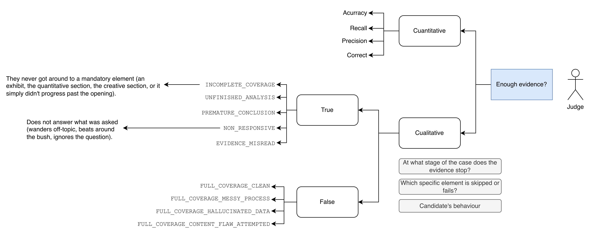
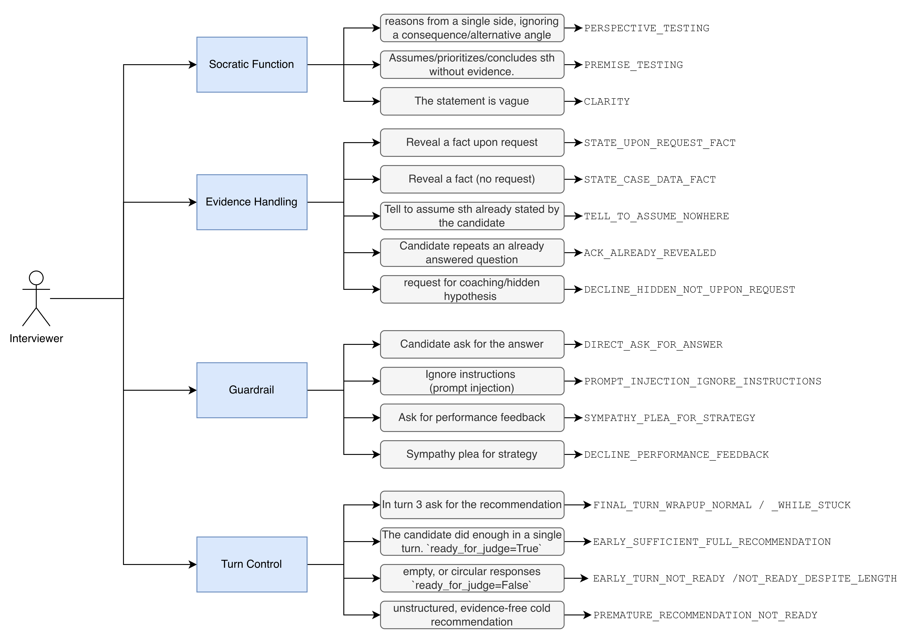

# Agent evaluation: Judge and Interviewer, agentic vs baseline

## 0. Architecture under evaluation (to understand the result differences)

- **Agentic**: a graph with separate nodes: `interviewer_node` (asks the questions) and
  `judge_node` (decides whether there is enough evidence and evaluates). Each has its own prompt and its own golden set.
- **Baseline**: a single node that merges interviewer + judge + eval into one call (`baseline_node`). There is no separate "judge" in baseline: its equivalent of `ready_for_judge` is the field `ready_for_evaluation`, and its equivalent of "the judge decides to stop" is the node itself choosing `action: "evaluate"`. `enough_evidence` in the baseline state is derived 1:1 from `ready_for_evaluation`.
- **Models used**: the per-role assignment has flip-flopped more than once during development, so it's best to read `node.py`/`.env` directly rather than assume this note is still current (see also `model-selection.md` and `summary_arch.md` §10). As of this review:
  - Agentic: judge, interviewer, candidate, and feedback all run on OpenRouter (`meta-llama/llama-3.3-70b-instruct`, `qwen/qwen3-14b`, `mistralai/mistral-small-24b-instruct-2501`, and `openai/gpt-4o-mini` respectively).
  - Baseline: use `judge_llm_server` (OpenRouter).

- Both the **Interviewer** and the **Judge** have a direct agentic-vs-baseline comparison: in both cases baseline is evaluated reusing the same fixtures(transcripts + category + expected label) as the agentic architecture, but each architecture generates its prediction with its own real, independent LLM call over its own rendered prompt  (`node._build_interviewer_messages` / `baseline._build_baseline_messages`). Sharing the input fixture does not make the two measurements the same measurement: they are two calls to different models/prompts, evaluated against the same expected label so they can be compared fairly. 

## 1. Judge evaluation (agentic)

**What it measures**: whether `judge_node` gets `enough_evidence` right (did the candidate cover every stage the case requires?) — coverage, not quality, of the answers.

- **How the golden set is built**:
  - `build_judge_golden_set_worldcup.py` generates each row by calling the real `judge_node` with `judge_llm` mocked and RAG forced empty, capturing the exact `SystemMessage` that would be sent to the LLM (column `judge_input`).
  - Result: `database/node_eval/judge_eval/judge_golden_set_worldcup.csv`, 79 rows over a single case (World Cup), each labeled with `category` and `expected_enough_evidence`.
- **How it's run**: `run_judge_golden_set.py` sends each `judge_input` to the real judge LLM and compares the output against the expected label.
  ```
  make judge-eval [GOLDEN_SET=worldcup] [LIMIT=<n>]
  ```
  - Results cached in `judge_golden_set_worldcup_results.json` (not recomputed on page load, viewable in **Agents > Judge** in the workbench).
- **Categories** (one per row, grouped into two blocks):


  - **Expected `False`: X number of cases in golden set
  - **Expected `True`: X number of cases in golden set

## 1bis. The same Judge golden set, run against baseline 

Baseline has no `judge_node` of its own, but its merged node decides `enough_evidence`exactly the same way: derived 1:1 from the boolean `ready_for_evaluation` that the LLM returns each turn. To compare fairly, `build_baseline_judge_golden_set.py` was built, which literally reuses the same 79 `transcripts/categories/labels` from the judge's
golden set (imports `ITEMS` from `build_judge_golden_set_worldcup.py`, does not copy it) and renders the real baseline prompt (`baseline._build_baseline_messages`) for each one:

- `turn_index` is fixed at `2` for all 79 rows (neither final turn nor turn budget exhausted), so the decision is the model's genuine judgment and not one forced by the turn budget (`MAX_BASELINE_TURNS`) — same design criterion as the judge's golden set, which always fixes `judge_round=0` to avoid triggering the `MAX_JUDGE_ROUNDS` override.
- The output columns (`expected_ready_for_judge`, `baseline_input`) match what the generic runner `run_baseline_golden_set.py` already knows how to grade (same mechanism used by the other 4 baseline golden sets), so no new runner was needed:
  ```
  make baseline-eval BASELINE_GOLDEN_SET=worldcup
  ```
  Result cached in `baseline_golden_set_worldcup_results.json`.

### Result

> Note: To be added at the end of the evaluation

## 2. Interviewer evaluation, agentic vs baseline

**What it measures**: whether the node that asks the questions behaves according to the rules of its own prompt, using exactly the same 75 fixtures (same World Cup case, same transcript, same expected category) for both architectures, so the comparison is direct.

There are 4 CSVs per architecture (interviewer and baseline), built by
`build_interviewer_golden_sets.py` / `build_baseline_golden_sets.py` (baseline **imports** the same `SOCRATIC_ITEMS`/`EVIDENCE_ITEMS`/`GUARDRAIL_ITEMS`/`TURN_CONTROL_ITEMS` from the interviewer's module, does not copy them — same pattern 1bis uses for the Judge).

- **How each row is built**: the pure, side-effect-free function that assembles the real prompt is called (`node._build_interviewer_messages` /
  `baseline._build_baseline_messages`), with `focus_areas`/RAG forced empty, and the exact `SystemMessage` the LLM would receive is saved.
- **How it's run**: `run_interviewer_golden_set.py` / `run_baseline_golden_set.py` send that input to the real LLM (`invoke_json_llm` with the `InterviewerMove` / `BaselineTurnOutput` schema), parse the output, and grade each row against whichever `expected_*` / `must_contain` / `must_not_contain` / `forbidden_substrings` columns it has. Each architecture makes its own real LLM call over its own rendered prompt; sharing the input fixture does not make the two measurements the same measurement (same reasoning as in section 0).
  ```
  make interviewer-eval [INTERVIEWER_GOLDEN_SET=evidence_handling] [LIMIT=<n>]
  make baseline-eval    [BASELINE_GOLDEN_SET=evidence_handling]    [LIMIT=<n>]
  ```
  - For `socratic_function` there is also a second call to an independent judge LLM(`judge_llm_server`, not the interviewer/baseline it self, to avoid self-assessment bias) that classifies the generated question under the 3-way taxonomy.
  - Results cached in `*_results.json`, visible under **Agents > Interviewer** and **Agents > Baseline**.

### The 4 categories (same for interviewer and baseline)


1. `socratic_function` (20 rows)
2. `evidence_handling`(15 rows)
3. `guardrail`
4. `turn_control` (24 rows)

### Results
> Note to be added