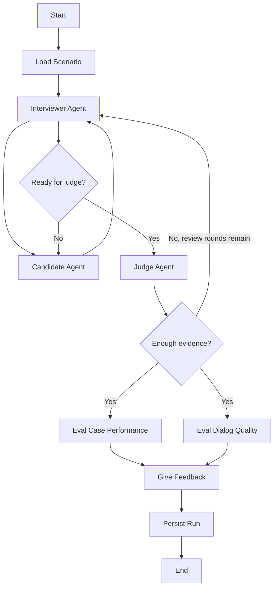
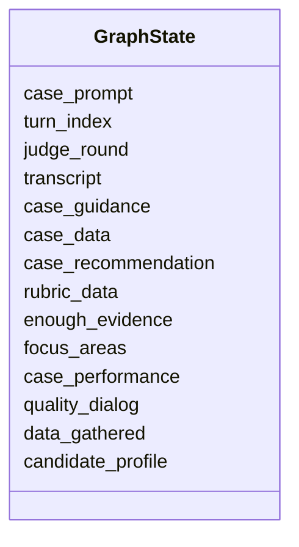
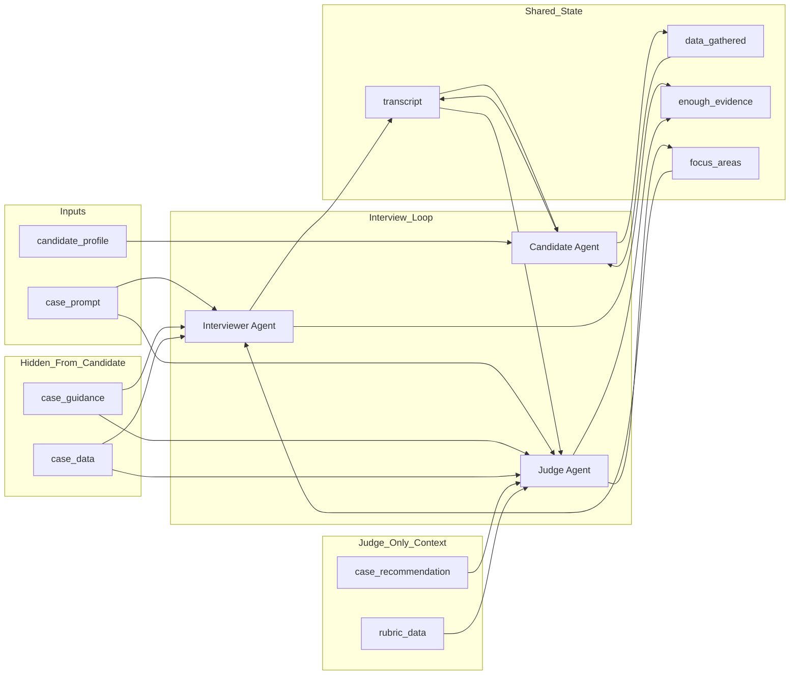
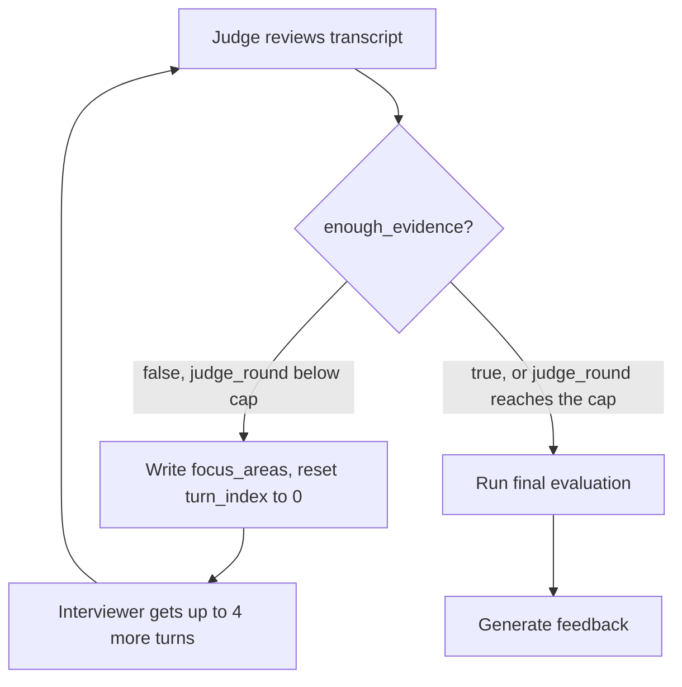

# Agentic Graph Design

This section describes the graph used for the agentic consulting case interview system. The system is built as a controlled interview loop where the interviewer gathers evidence from the candidate, while the judge checks whether the conversation contains enough information to evaluate the candidate properly.

The design follows the project goal of comparing a single-agent baseline with a specialised agentic architecture, where the interviewer and judge have separate responsibilities instead of sharing one generic role.

## Graph overview

The interview is organised as an adaptive loop between the Interviewer Agent and the Candidate Agent. The Interviewer Agent presents the case, asks follow-up questions, and decides on every turn whether the conversation should continue or whether the transcript is ready to move to the judge.

After each candidate response, the Interviewer Agent updates the transcript and reviews the current state of the interview. If the candidate's reasoning still needs clarification, the Interviewer Agent asks another question and the loop continues. This allows several interviewer-candidate turns to happen before the Judge Agent is involved.

The Judge Agent only reviews the transcript once the Interviewer Agent has flagged it as ready. That review is a second, independent check: the judge can agree and send the case forward for evaluation, or disagree and send the interviewer back for another round with fresh focus areas. Only once the judge is satisfied, or has run out of review rounds, does the graph move on to scoring and feedback.

## Agent roles

### Interviewer agent

The interviewer agent controls the visible interview. It presents the case, asks questions, reacts to the candidate's answers, and uses the judge's focus areas to decide what to explore next. Each move is either a follow-up question or a direct reveal of one specific candidate-visible case block, never both, and the interviewer also makes its own retrieval decision against the case-guide knowledge base before responding (see `RAG.md`).

It does not produce the final evaluation. Its role is to collect useful evidence from the candidate, and to make its own first-pass judgement, each turn, on whether that evidence is now sufficient.

### Candidate agent

The candidate agent represents the interview participant in controlled experiments. It receives the scenario's candidate profile, the public transcript, and its own running record of information already gathered from the interviewer.

It never sees the judge's private assessment, the case guidance, the hidden reference recommendation, or the rubric. The case prompt itself reaches the candidate only indirectly, as the opening line of the transcript, not as a separate input.

### Judge agent

The judge agent reviews the transcript once the interviewer has flagged it as ready. It reads the case prompt, the full transcript, the case guidance, the case data, the hidden reference recommendation, and the rubric, and it can retrieve supporting excerpts from the case-guide knowledge base before deciding (see `RAG.md`). It decides whether the current evidence is enough to assess the candidate.

If the evidence is incomplete, the judge writes up to three new focus areas for the interviewer and sends the transcript back for another round. If the evidence is sufficient, the graph moves on to final evaluation.

## Baseline graph, for comparison

The baseline graph (`src/main/studio/baseline.py`) is the single-agent design this project compares the agentic architecture against. It has four nodes instead of eight: `load_scenario`, a single `baseline` node, `candidate`, and `persist_run`. The `baseline` node plays interviewer, judge, evaluator, and feedback writer in one LLM call per turn, using one schema whose `action` field is `question`, `reveal`, or `evaluate`. When the model chooses `evaluate`, case performance, dialog quality, and the feedback text all come back in that same response, instead of the three separate calls the agentic graph makes.

Baseline also runs interviewer, candidate, and judge on the same underlying model, rather than the role-differentiated LLMs described in `model-selection.md`. It shares the same four-turn cap described below, but has nothing equivalent to the judge's review-round budget or the parallel evaluation fan-out: the moment its own `ready_for_evaluation` flag is true, or the turn cap is reached, that same call produces the full evaluation directly. See `summary_arch.md` for the full baseline flow diagram.

## State design

The graph state stores both the public interview information and the private evaluation information. This separation is important because the candidate should only see the conversation, while the interviewer and judge can use additional internal context.

The state also carries a handful of bookkeeping and retrieval-logging fields not shown above (`run_id`, `thread_id`, `rag_query_log`, `llm_usage`, and similar); the full inventory lives in `summary_arch.md`.

## State fields

| Field | Purpose | Access |
|---|---|---|
| `case_prompt` | Opening case statement, shown to the candidate verbatim as the interviewer's first message. | Interviewer, Judge; reaches the Candidate only through the transcript |
| `candidate_profile` | Controlled candidate persona and behaviour used for experiments. | Candidate setup; not part of judge reasoning |
| `transcript` | Full interview conversation used for evaluation. | Candidate sees its own visible slice; Interviewer, Judge, and the evaluation nodes see the full version |
| `case_guidance` | Hidden interviewer guidance extracted from the case data (expected framework, facts to reveal, common traps). Hidden from the candidate. | Interviewer, Judge |
| `case_data` | The case's full block set, including candidate-visible prompt blocks and hidden data blocks. The interviewer resolves it into what it may reveal; the judge reads it in full. | Interviewer, Judge |
| `case_recommendation` | The case's own hidden reference recommendation, used as the benchmark the judge compares the candidate's answer against. Not shown to the candidate or the interviewer. | Judge reads only |
| `rubric_data` | The scoring rubric loaded from `rubric.json`: dimensions and per-score criteria. | Judge and the evaluation nodes |
| `turn_index` | Counts interviewer turns since the last judge review. | Interviewer writes; Judge resets it to 0 whenever it sends the case back |
| `judge_round` | Counts how many times the judge has reviewed the transcript, capped at `MAX_JUDGE_ROUNDS`. | Judge |
| `enough_evidence` | Whether the transcript is ready for evaluation. Set first by the interviewer's own readiness check, then re-checked independently by the judge. | Interviewer and Judge write; graph reads |
| `focus_areas` | Up to three missing areas the judge wants the interviewer to chase next round. Replaced, not appended, on every judge review. | Judge writes; Interviewer reads |
| `case_performance` | Structured scoring of the candidate's case-solving quality. | Eval Case Performance node |
| `quality_dialog` | Structured scoring of communication and interaction quality. | Eval Dialog Quality node |
| `data_gathered` | Candidate's own running memory of factual case information learned so far. | Candidate only |

## Read and write logic

`case_guidance` and `case_data` are hidden from the candidate but shared between interviewer and judge; only `case_recommendation` and `rubric_data` are judge-exclusive within the main interview loop.

## Control logic

Two bounded budgets, not a single flag, keep the loop from running forever.

On the interviewer side, `turn_index` counts turns since the last judge review. Once it reaches 3, the interviewer is forced into a wrap-up move: it must ask the candidate directly for a final recommendation, and `enough_evidence` is forced to false no matter what the model returns, so that answer still gets its own turn in the transcript. One turn later, once four turns have passed, the interviewer hands off to the judge immediately without spending another turn, so the candidate's recommendation stays the last line before evaluation.

On the judge side, each review increments `judge_round`. If the judge is not satisfied and the round budget (`MAX_JUDGE_ROUNDS`, currently 2) has not been reached yet, it writes new focus areas, `turn_index` resets to 0, and the graph routes back to the interviewer for a fresh batch of turns aimed at those focus areas. If the round budget is exhausted and the judge is still not satisfied, `enough_evidence` is forced to true and `focus_areas` is cleared, so the interview always reaches evaluation instead of looping indefinitely.

Together this bounds the whole interview to at most two judge reviews of up to four interviewer turns each, regardless of what either model decides.

## Final feedback

Final feedback is generated only after the interview loop has ended and the Judge Agent's downstream evaluation nodes have completed the evaluation fields. The feedback is not based on a generic impression of the candidate; it is derived from the transcript and from the structured scores those nodes produced.

The evaluation nodes score the candidate on a 1-4 scale across two groups of fields, each with a short rationale grounded in the transcript. The first group measures case performance: opening (`case_opening`), structure (`case_structure`), quantitative reasoning where the case calls for it (`case_math_answer`), creativity where the case calls for it (`case_creative_answer`), final recommendation (`final_recommendation`), overall structure, overall problem solving, and overall communication. The second group measures interaction quality: clarity and concision, responsiveness and adaptation, groundedness, confidence calibration, and multi-turn coherence. (`rubric.json` itself still documents a fifth, "Excellent" level for each dimension; live scoring clamps every value to 1-4 and that fifth level is never used.)

Any field can instead be marked `not_tested` when the transcript does not support scoring it, whether because the LLM judged the evidence insufficient or because the case never exercised that dimension in the first place. This keeps the system from forcing a score where the case did not actually test that skill.

The feedback node uses these structured fields, plus its own retrieval pass against the case-guide knowledge base (see `RAG.md`), to produce a concise coaching report. It summarises the candidate's main strengths, identifies the most important weaknesses, and explains how the candidate could improve in future case interviews. The feedback must stay grounded in the transcript and in the evaluation rationales, rather than introducing judgements the scoring step never made.
