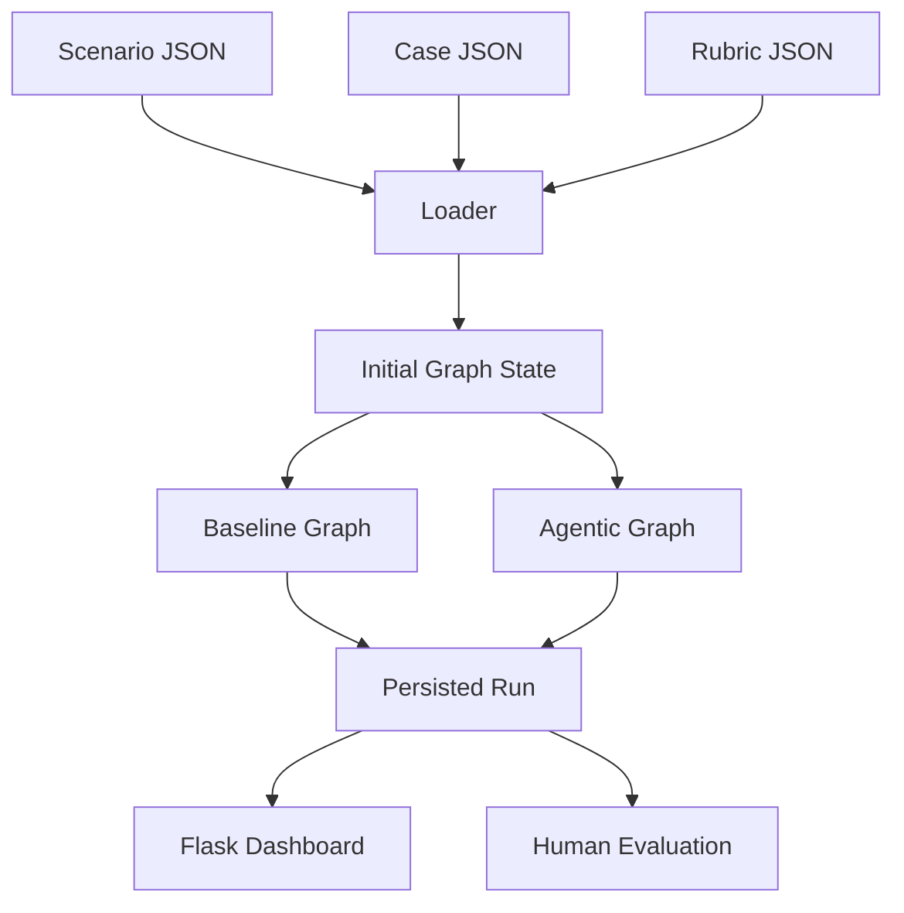
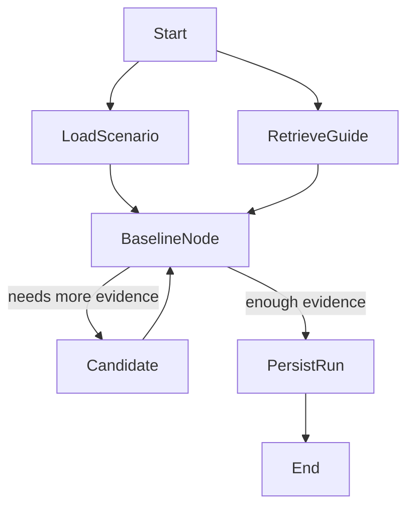
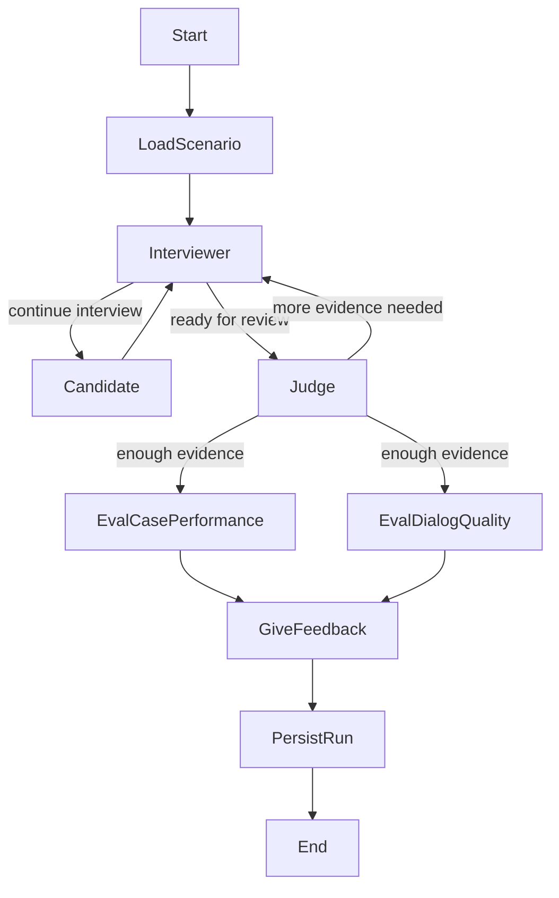

# System Architecture Summary

## 1. Overview

The active program is a LangGraph-based evaluation workbench for consulting case interview simulations. It currently supports two executable graph variants:

1. `baseline`: one graph node acts as the interviewer and later performs evaluation and feedback.
2. `agentic`: separate interviewer and judge nodes coordinate before the evaluation stage.

The current MVP is not yet a live student-facing application. Instead, it runs controlled simulations with:

- a scenario JSON that defines the candidate profile and expected scores;
- a case JSON that contains prompt, visible data blocks, hidden guidance, and final recommendation;
- a shared rubric;
- an LLM-backed synthetic candidate node used to answer interview questions.

This makes the system suitable for comparing architectures under repeatable conditions.

## 2. Active Runtime Structure

The active code lives under `src/main/`:

- `studio/`: LangGraph graphs, prompt orchestration, retrieval, loading, and persistence
- `web/`: Flask dashboard for inspecting runs, traces, and human evaluations
- `artifacts/`: SQLite database storing runs and state traces

Supporting assets live under:

- `src/scenarios/`: scenario definitions
- `src/synthetic-dataset/`: case content used by the active runtime
- `src/database/`: shared knowledge assets, rubric data, and vector store
- `doc/`: architecture and prompt documentation
- `archive/`: older prototypes and research material, not part of the active system

## 3. High-Level Execution Model

Both graph variants consume the same runtime bundle:

The loader resolves a scenario, loads the referenced case, adapts the shared rubric, and builds a runtime state consumed by the graph.

## 4. Shared State Model

Both graphs use the same typed state object (`AgenticGraphState`). The main fields are:

- `scenario_ref`
- `case_prompt`
- `candidate_profile`
- `transcript`
- `turn_index`
- `case_guidance`
- `case_data`
- `case_recommendation`
- `focus_areas`
- `enough_evidence`
- `judge_round`
- `case_performance`
- `quality_dialog`
- `data_gathered`
- `profitability_knowledge_base`
- `retrieved_profitability_context`

The transcript is the main shared evidence structure. It stores interviewer turns, candidate turns, evaluation markers, and the final feedback line.

## 5. Input Assets

### 5.1 Scenarios

Synthetic scenarios live in `src/scenarios/synthetic-based/`. A scenario primarily provides:

- `scenario_id`
- `case_id`
- candidate persona instructions
- expected rubric scores for later comparison

### 5.2 Cases

Case JSON files live in `src/synthetic-dataset/`. They are adapted into:

- `opening_block`
- `visible_blocks`
- `hidden_blocks`
- `blocks_by_type`
- `knowledge_sources`

This allows the interviewer to reveal only candidate-visible data while still keeping hidden guidance and the expected recommendation available for evaluation.

### 5.3 Rubric

The runtime uses one shared rubric file from `src/scenarios/rubric/rubric.json`. It is adapted into a stable list of dimensions with criteria and score scale metadata.

## 6. Baseline Graph

The baseline graph is compiled from `src/main/studio/baseline.py`.

The baseline flow works as follows:

1. Load scenario and case assets.
2. Retrieve consulting guide context from the persistent PDF RAG store.
3. Run a single baseline interviewer/evaluator node.
4. Alternate with the synthetic candidate until the node decides it has enough evidence, or until the maximum number of interviewer turns is reached.
5. Run case-performance scoring, dialog-quality scoring, and final feedback generation inside the baseline path.
6. Persist the final run.

In this architecture, the same logical agent handles interviewing, stopping, evaluation, and final feedback.

## 7. Agentic Graph

The agentic graph is compiled from `src/main/studio/agentic.py`.

The agentic flow separates responsibilities:

- `interviewer_node`: asks the next question or reveals candidate-visible data
- `candidate_node`: produces the synthetic candidate response and updates `data_gathered`
- `judge_node`: decides whether enough evidence exists and, if not, writes `focus_areas`
- `eval_case_performance_node`: scores case-solving performance
- `eval_dialog_quality_node`: scores communication quality
- `give_feedback_node`: writes final coaching feedback

The interviewer uses judge-generated `focus_areas` as direct instructions for the next follow-up question. This is the key behavioural difference from the baseline graph.

## 8. Synthetic Candidate Role

The current system simulates the candidate with an LLM node rather than a human user. The candidate node:

- sees only public transcript lines;
- does not see judge notes or hidden guidance;
- follows the scenario persona;
- updates a running `data_gathered` list of factual case information learned so far.

This design keeps experiments reproducible and allows architecture comparison before building a full interactive front end.

## 9. Retrieval Architecture

The active retrieval layer is split into two independent paths.

### 9.1 Local Profitability Retrieval

Implemented in `src/main/studio/rag/knowledge_base.py`.

This path:

- reads case-declared knowledge sources;
- supports local chunking of `.pdf`, `.md`, `.txt`, and `.json`;
- performs lightweight lexical retrieval in memory;
- is used mainly for case-performance evaluation and baseline interviewing.

### 9.2 Persistent Guide PDF RAG

Implemented in `src/main/studio/rag/rag_case_guide.py` and `src/main/studio/rag/case_guide_context.py`.

This path:

- indexes `src/database/ConsultingCaseGuide-PPML.pdf`;
- stores embeddings in Chroma under `src/database/vectorstore/consulting_case_guide/`;
- builds query text from graph state, node goal, focus areas, and latest candidate reasoning;
- injects retrieved guide snippets into judge, evaluation, and feedback prompts.

The retrieval split exists because case-specific methodology and general consulting interview guidance play different roles in the prompts.

## 10. LLM Layer

All active graph nodes use the shared LLM client in `src/main/studio/llm_server.py`.

The runtime is configured to call an OpenAI-compatible endpoint, usually LM Studio, through:

- `LMSTUDIO_BASE_URL`
- `LMSTUDIO_MODEL`
- `LMSTUDIO_API_KEY`
- `LMSTUDIO_TEMPERATURE`

This means the program is model-agnostic as long as the backend exposes the OpenAI chat interface.

## 11. Persistence and Observability

Run persistence is implemented in `src/main/studio/persistence.py` and stored in `src/main/artifacts/runs.sqlite`.

There are two main tables:

1. `runs`: final graph outputs and serialized state
2. `agent_state_traces`: step-level state transitions for traced nodes

The agentic graph currently traces at least:

- interviewer steps
- judge steps

Each trace captures:

- node name
- actor
- step index
- scenario reference
- before/after values for key state fields
- a computed summary of changed fields

This makes the system inspectable beyond final scores.

## 12. Dashboard and Human Evaluation

The Flask app in `src/main/web/app.py` provides a lightweight workbench over the SQLite database.

Main views:

- `/`: run list
- `/compare`: side-by-side run comparison
- `/traces`: trace run index
- `/runs/<run_id>`: final run detail
- `/runs/<run_id>/trace`: step-by-step trace detail

The dashboard also supports human evaluation storage through a `human_evaluations` table. Human evaluators can score rubric dimensions and dialog-quality dimensions, add rationales and evidence, and compare:

- expected scores from the scenario
- model scores from the graph
- human scores entered in the dashboard

The store layer computes comparison rows and error metrics such as exact match rate, off-by-one rate, and mean absolute error.

## 13. Evaluation Outputs

The active program produces three main evaluation outputs:

1. `case_performance`: structured scoring for case-solving dimensions
2. `quality_dialog`: structured scoring for communication and interaction dimensions
3. final written feedback appended to the transcript

The current case-performance fields are:

- `case_opening`
- `case_structure`
- `case_math_answer`
- `case_creative_answer`
- `final_recommendation`
- `overall_structure`
- `overall_problem_solving`
- `overall_communication`

The current dialog-quality fields are:

- `clarity_and_concision`
- `responsiveness_and_adaptation`
- `groundedness`
- `confidence_calibration`
- `multi_turn_coherence`

## 14. What Is Active vs Experimental

Active MVP:

- `src/main/studio/`
- `src/main/web/`
- `src/scenarios/`
- `src/synthetic-dataset/`
- `src/database/`

Experimental but separate:

- `src/interviewer_ft/`: fine-tuning pipeline and inference utilities for interviewer experiments

Not part of the active architecture:

- `archive/`: legacy prototypes and research artifacts

## 15. Current Architectural Position

The current program is best understood as an evaluation and experimentation platform rather than a finished tutoring product.

Its real architectural strengths today are:

- direct baseline vs agentic comparison on the same scenario assets;
- explicit shared state in LangGraph;
- dual retrieval grounding;
- persisted runs and state traces;
- human-in-the-loop evaluation through the dashboard.

Its main current limitation is that the “candidate” is still simulated. The system is therefore strongest for controlled research and architecture comparison, and is not yet a deployed end-user interview coach with a live conversational UI.
