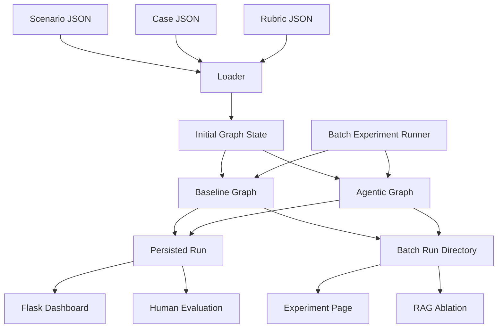
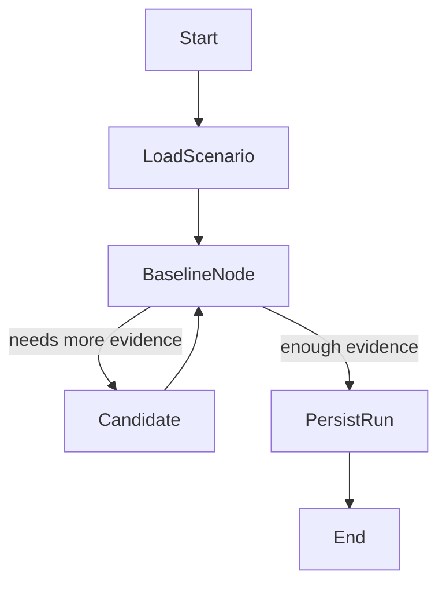
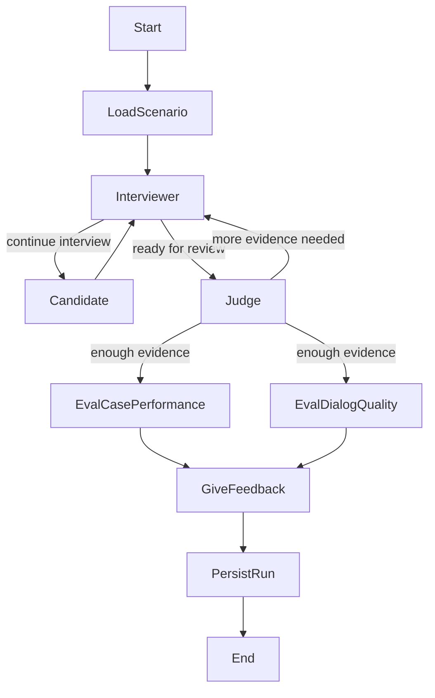

# System Architecture Summary

## 1. Overview

The active program is a LangGraph-based evaluation workbench for consulting case interview simulations. It currently supports two executable graph variants:

1. `baseline`: one graph node acts as interviewer, evaluator, and feedback-writer in a single combined LLM call.
2. `agentic`: separate interviewer, judge, evaluation, and feedback nodes coordinate across several LLM calls.

The current MVP is not yet a live student-facing application. Instead, it runs controlled simulations with:

- a scenario JSON that defines the candidate profile and reference scores;
- a case JSON that contains prompt, visible data blocks, hidden guidance, and final recommendation;
- a shared rubric;
- an LLM-backed synthetic candidate node used to answer interview questions.

Beyond the baseline-vs-agentic comparison, the project has grown a second axis of experimentation: retrieval quality and RAG ablation. A golden-set-driven retrieval evaluator and a with/without-RAG scoring ablation now sit alongside the original run/trace/human-evaluation workbench, and a batch-experiment runner (`run_all_scenarios.py`) produces the repeated-run data both the "Experiment" and "RAG Evaluation" dashboard pages consume.

## 2. Active Runtime Structure

The active code lives under `src/main/`:

- `studio/`: LangGraph graphs, prompt orchestration, retrieval, loading, and persistence
- `studio/rag/`: dual RAG retrieval implementations plus golden-set/chunk-dump tooling
- `web/`: Flask dashboard for inspecting runs, traces, experiments, RAG evaluation, and human evaluations
- `artifacts/`: SQLite database of single runs, plus `batch_runs/` snapshots from the batch experiment runner
- `database/vectorstore/`: generated Chroma indices only (no source documents)
- `server_HPC/`: standalone FastAPI servers plus a SLURM launcher for self-hosting Mistral-Nemo/Llama-3.3-70B on the university GPU cluster; not imported by the active graphs, and corresponds to the commented-out GPU-hosted client block in `llm_server.py`

Supporting assets live under:

- `src/scenarios/synthetic-based/`: scenario definitions actually used by the loader
- `src/scenarios/casebook-based/`: casebook-derived scenario JSON, not referenced by any code path yet
- `src/synthetic-dataset/`: case content used by the active runtime
- `src/database/`: source PDFs, `rag_evaluation/` golden sets and chunk dumps, and a case-bank (`agsm_cases/`, `duke_cases/`, `harvard_cases/`, `casebooks.json`, `case_metadata.json`) that is likewise not wired into any code path yet
- `src/schemas/`: standalone JSON Schema files, not referenced by any Python code (superseded in practice by the Pydantic models in `state.py`)
- `doc/`: architecture and prompt documentation
- `archive/`: older prototypes and research material, not part of the active system

Directories described above as "not referenced by any code path" are planned-but-not-yet-integrated data layers, not dead code left over from a removed feature: they are kept for a future integration pass.

## 3. High-Level Execution Model

Both graph variants consume the same runtime bundle:

The loader resolves a scenario, loads the referenced case, adapts the shared rubric, and builds a runtime state consumed by the graph. `run_all_scenarios.py` drives either graph repeatedly across scenarios (with a configurable repeat count) and writes per-graph and combined JSONL/CSV plus a `summary.json` into a timestamped `src/main/artifacts/batch_runs/<batch>/` directory, which is what the Experiment page and `make rag-ablation` read from.

## 4. Shared State Model

Both graphs use the same typed state object (`AgenticGraphState`, `src/main/studio/state.py`). The main fields are:

- `scenario_ref`
- `case_prompt`
- `candidate_profile`
- `transcript`
- `turn_index`
- `case_guidance`
- `case_data`
- `case_recommendation`
- `focus_areas`
- `enough_evidence`
- `judge_round`
- `case_performance`
- `quality_dialog`
- `data_gathered`
- `retrieved_profitability_context`
- `candidate_reasoning` / `interviewer_reasoning`: last free-text reasoning captured from each role, used for guide-retrieval query building
- `rag_query_log`: append-only log of retrieval calls (query, source, hit count) across the run, using a custom reducer so the two parallel eval nodes do not clobber each other's entries
- `llm_usage`: append-only per-call token accounting, same append reducer pattern as `rag_query_log`
- `run_id` / `trace_step_index`: identifiers used by the tracing/persistence layer
- `thread_id`, `rubric_data`

The transcript is the main shared evidence structure. It stores interviewer turns, candidate turns, evaluation markers, and the final feedback line.

## 5. Input Assets

### 5.1 Scenarios

Synthetic scenarios live in `src/scenarios/synthetic-based/`. A scenario primarily provides:

- `scenario_id`
- `case_id`
- candidate persona instructions
- reference rubric scores for later comparison

### 5.2 Cases

Case JSON files live in `src/synthetic-dataset/`. They are adapted into:

- `opening_block`
- `visible_blocks`
- `hidden_blocks`
- `blocks_by_type`

This allows the interviewer to reveal only candidate-visible data while still keeping hidden guidance and the reference recommendation available for evaluation.

### 5.3 Rubric

The runtime uses one shared rubric file from `src/scenarios/rubric/rubric.json`. It is adapted into a stable list of dimensions with criteria and score scale metadata. (A separate, capitalized `src/database/Rubric/rubric.json` also exists but is not read by any code: the loader only reads the lowercase path above.)

## 6. Baseline Graph

The baseline graph is compiled from `src/main/studio/baseline.py`.

The baseline flow works as follows:

1. Load scenario and case assets.
2. Run a single, traced baseline interviewer/evaluator node (`baseline_node`). On each turn it decides inline whether to consult the case guide (a deliberately simple, query-less lookup) and the profitability guide (LLM-scouted and query-driven) before producing its next move.
3. Alternate with the (also traced) synthetic candidate node until the node decides it has enough evidence, or until `MAX_BASELINE_TURNS` is reached.
4. On the final forced turn, produce case-performance scoring, dialog-quality scoring, and final feedback in the same combined LLM call (`parse_baseline_output`, action in `{question, reveal, evaluate}`).
5. Persist the final run.

In this architecture, the same logical agent handles interviewing, stopping, retrieval, evaluation, and final feedback; there is no separate persistent-retrieval node or standalone eval/feedback node. This single-node design is also what the RAG ablation tooling patches around when producing a "without RAG" baseline arm.

## 7. Agentic Graph

The agentic graph is compiled from `src/main/studio/agentic.py`.

The agentic flow separates responsibilities:

- `interviewer_node`: asks the next question or reveals candidate-visible data
- `candidate_node`: produces the synthetic candidate response and updates `data_gathered`
- `judge_node`: decides whether enough evidence exists and, if not, writes `focus_areas` (routing function `route_after_judge_agentic_02`)
- `eval_case_performance_node`: scores case-solving performance
- `eval_dialog_quality_node`: scores communication quality
- `give_feedback_node`: writes final coaching feedback

`eval_case_performance` and `eval_dialog_quality` run as genuinely parallel branches of the same LangGraph superstep (both fan out from `judge` and fan back into `give_feedback`). This is why `rag_query_log` and `llm_usage` use append-only reducers in the shared state: without them, concurrent writes from the two eval nodes would clobber each other.

The interviewer uses judge-generated `focus_areas` as direct instructions for the next follow-up question. This is the key behavioural difference from the baseline graph. See `graph.md` for the turn and round budgets that bound how long this loop can run.

## 8. Synthetic Candidate Role

The current system simulates the candidate with an LLM node rather than a human user. The candidate node:

- sees only public transcript lines;
- does not see judge notes or hidden guidance;
- follows the scenario persona;
- updates a running `data_gathered` list of factual case information learned so far.

This design keeps experiments reproducible and allows architecture comparison before building a full interactive front end.

## 9. Retrieval Architecture

The active retrieval layer is split into two independent paths, each with a persistent Chroma vector store built from a source PDF in `src/database/` and persisted under `src/main/database/vectorstore/`. Both graphs import a stable "context" bridge module rather than the raw retrieval module, so tests can patch retrieval without touching the underlying vector store.

### 9.1 Case Guide RAG

Implemented in `src/main/studio/rag/rag_case_guide.py`, fronted by `case_guide_context.py`.

- indexes `src/database/ConsultingCaseGuide-PPML.pdf` into `src/main/database/vectorstore/consulting_case_guide/` (`FastEmbedEmbeddings`, `BAAI/bge-small-en-v1.5`);
- builds query text from graph state, node goal, focus areas, and latest interviewer/candidate reasoning;
- the baseline graph uses a deliberately simpler, query-less retrieval path (`get_baseline_case_guide_context`) for this source, so the agentic-vs-baseline comparison also implicitly compares scouted vs. unscouted case-guide retrieval.

### 9.2 Profitability Guide RAG

Implemented in `src/main/studio/rag/rag_profitability_guide.py`, fronted by `profitability_guide_context.py`.

- indexes `Principles-of-Managerial-Accounting-profitability.pdf` into `src/main/database/vectorstore/profitability_guide/`, plus a hand-written navigation guide (`src/database/profitability_source_navigation.json`) that gets folded into the scouting prompt;
- performs an LLM-scouted retrieval decision (`ProfitabilityRagScoutingDecision`) in both baseline and agentic graphs: the model explicitly decides whether to consult this source before querying it;
- is used mainly for case-performance evaluation.

The retrieval split exists because case-specific methodology and general consulting/accounting guidance play different roles in the prompts, and because the two sources warranted different retrieval-decision strategies (query-less vs. LLM-scouted) to compare.

### 9.3 Retrieval Evaluation Tooling

`src/main/studio/rag/` also holds evaluation/authoring tooling, run manually (no `make` target):

- `dump_vectorstore_chunks.py`: dumps every chunk of both vector stores to CSV for manual golden-set authoring.

See §11 for how this tooling feeds retrieval-quality metrics and RAG ablation.

## 10. LLM Layer

All active graph nodes use per-role LLM clients defined in `src/main/studio/llm_server.py` and assigned in `src/main/studio/node.py`. Five `ChatOpenAI` clients are defined; not all are wired into an active role:

| Client | Provider / model | Wired to |
|---|---|---|
| `interviewer_llm_server` | OpenRouter, `qwen/qwen3-14b` (code default, matches current `.env`) | interviewer (agentic) |
| `candidate_llm_server` | OpenRouter, `mistralai/mistral-small-24b-instruct-2501` | candidate (agentic) |
| `judge_llm_server` | OpenRouter; code default `meta-llama/llama-3.1-70b-instruct`, currently overridden in `.env` to `meta-llama/llama-3.3-70b-instruct` | judge (agentic); candidate, judge, and interviewer all share this one client in baseline |
| `feedback_llm_server` | OpenRouter, `openai/gpt-4o-mini` | feedback (agentic only; baseline has no separate feedback role) |
| `lmstudio_llm_server` | Local LM Studio (`LMSTUDIO_MODEL`, currently `phi-4`) | not wired to any graph role; kept as a manual fallback and pinged only by the API-connection smoke test (skipped by default -- requires the LM Studio app running locally) |
| `openai_llm_server` | OpenAI direct, `gpt-5.4-nano` | not wired to any graph role; pinged only by the API-connection smoke test |

In the **agentic** graph, `node.py` currently gives each role its own dedicated client: `interviewer_llm = interviewer_llm_server`, `candidate_llm = candidate_llm_server`, `judge_llm = judge_llm_server`, `feedback_llm = feedback_llm_server`. A comment directly above that block in `node.py` states the intent explicitly: "Per-role servers: all four roles on OpenRouter."

## 11. RAG Evaluation and Ablation

Two independent evaluation mechanisms sit behind the workbench's single "RAG Evaluation" page. No "RAG Triad" (context-relevance/faithfulness/answer-relevance) evaluator was ever implemented; that idea was dropped from the design diagram in favor of the two below.

### 11.1 Retrieval-Quality Metrics

Computed live (recomputed on each page load) by `src/main/web/retrieval_eval.py` against **generation golden sets**: `src/database/rag_evaluation/generation_golden_set_case_guide.csv` and `generation_golden_set_profitability.csv`. Each row carries a query, an reference answer, a category tag, and exact ground-truth `source_chunk_ids`. Metrics: Precision@K, Recall@K, Hit Rate, and Mean Reciprocal Rank, broken down overall and by category/source document.

### 11.2 RAG Ablation

Implemented in `src/rag_ablation_eval.py`, surfaced by `src/main/web/rag_ablation.py`. Rather than grading retrieval in isolation (there is no ground truth for a full interview transcript), this replays an existing experiment batch's stored transcripts through the same `eval_case_performance`/`eval_dialog_quality` nodes a second time with retrieval content forced empty (the scouting decision of *whether* to consult a source still runs; only the retrieved content is suppressed), then diffs the resulting scores against the original with-RAG scores per dimension (mean delta and mean absolute delta).

Run via `make rag-ablation BATCH=<batch_dir_name> [LIMIT=<n>]`; results are cached to `rag_ablation_results.{json,csv}` inside that batch's directory and read (not recomputed) by the dashboard, since each ablated record costs a real judge call. **Known gap:** the ablation script's baseline-graph branch calls `baseline.evaluate_case_performance`/`baseline.evaluate_dialog_quality`, functions that no longer exist now that baseline uses one combined `baseline_node`. Running the ablation against a batch containing baseline-graph records currently raises an `AttributeError`.

## 12. Persistence and Observability

Run persistence is implemented in `src/main/studio/persistence.py` and stored in `src/main/artifacts/runs.sqlite`.

There are two main tables:

1. `runs`: final graph outputs and serialized state
2. `agent_state_traces`: step-level state transitions for traced nodes

Both graphs trace their interviewer-equivalent and judge-equivalent nodes: agentic traces `interviewer` and `judge`; baseline traces `baseline` and `candidate`. Each trace captures:

- node name
- actor
- step index
- scenario reference
- before/after values for key state fields
- a computed summary of changed fields

Separately, `src/run_all_scenarios.py` (the batch experiment runner) writes flat per-run records, including flattened scores and summarized LLM token usage, to timestamped directories under `src/main/artifacts/batch_runs/`, independent of the SQLite store. This is what feeds the Experiment page and RAG ablation, and lets a scenario be repeated N times per graph (default 4) to see run-to-run variance rather than inspecting a single run.

## 13. Dashboard and Human Evaluation

The Flask app in `src/main/web/app.py` provides a lightweight workbench over the SQLite database and the batch-run directories.

Main views:

- `/`: run list (also surfaces per-run trace counts and a link into `/compare`)
- `/compare`: side-by-side run comparison
- `/experiment`: batch picker with aggregate per-graph metrics (error rate, avg turn index/judge rounds, score histograms, token/LLM-call averages) across a repeated-run batch
- `/experiment/<dir_name>/<slug>`: per-scenario drill-down across repeats within a batch, joined against the scenario's own reference scores
- `/rag-evaluation`: retrieval-quality metrics (live) and RAG ablation results (cached per batch), on one page
- `/runs/<run_id>`: final run detail
- `/runs/<run_id>/trace`: step-by-step trace detail

The dashboard also supports human evaluation storage through a `human_evaluations` table, plus a small JSON API (`/api/runs/<run_id>/human-evaluation`, `/api/runs/<run_id>/scores`) and a `?format=json` toggle on most HTML routes. Human evaluators can score rubric dimensions and dialog-quality dimensions, add rationales and evidence, and compare:

- reference scores from the scenario
- model scores from the graph
- human scores entered in the dashboard

The store layer computes comparison rows and error metrics such as exact match rate, off-by-one rate, and mean absolute error.

## 14. Evaluation Outputs

The active program produces three main evaluation outputs:

1. `case_performance`: structured scoring for case-solving dimensions
2. `quality_dialog`: structured scoring for communication and interaction dimensions
3. final written feedback appended to the transcript

The current case-performance fields are:

- `case_opening`
- `case_structure`
- `case_math_answer`
- `case_creative_answer`
- `final_recommendation`
- `overall_structure`
- `overall_problem_solving`
- `overall_communication`

The current dialog-quality fields are:

- `clarity_and_concision`
- `responsiveness_and_adaptation`
- `groundedness`
- `confidence_calibration`
- `multi_turn_coherence`
