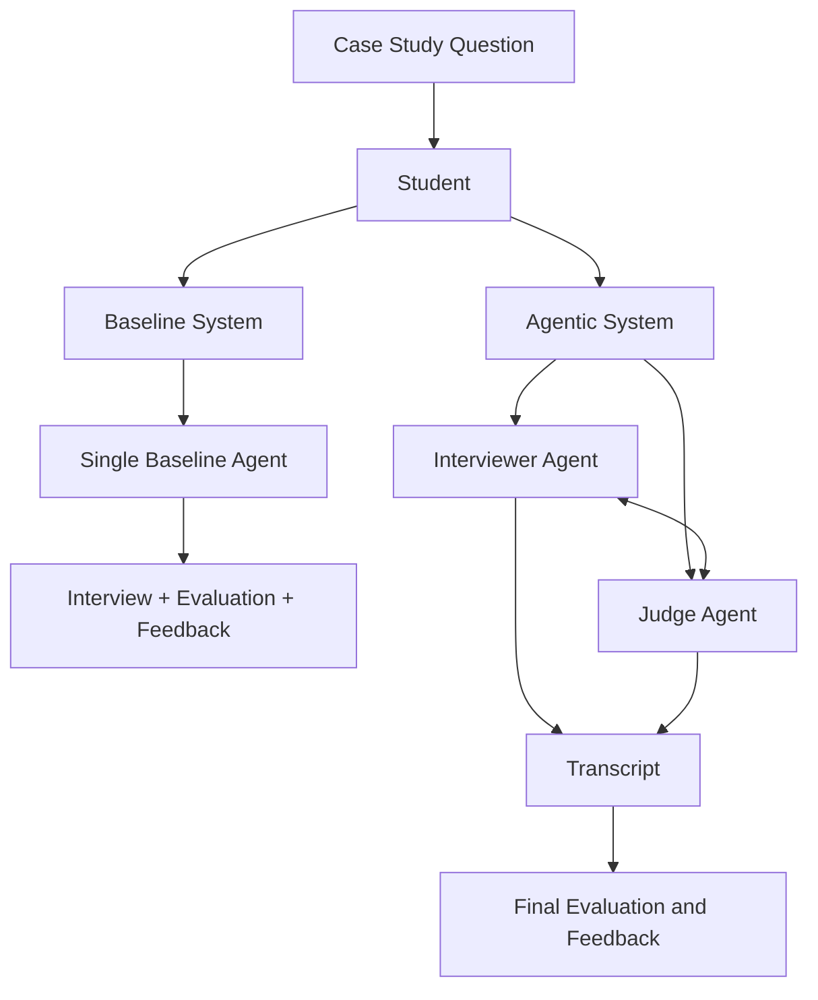
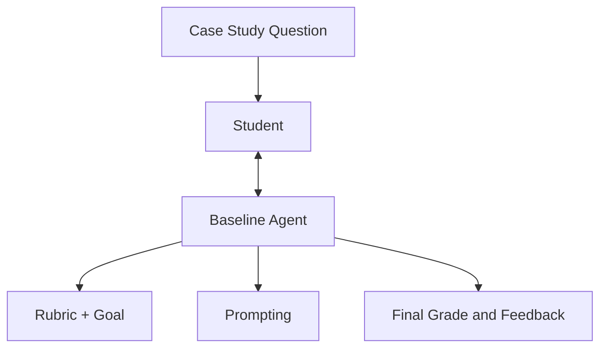
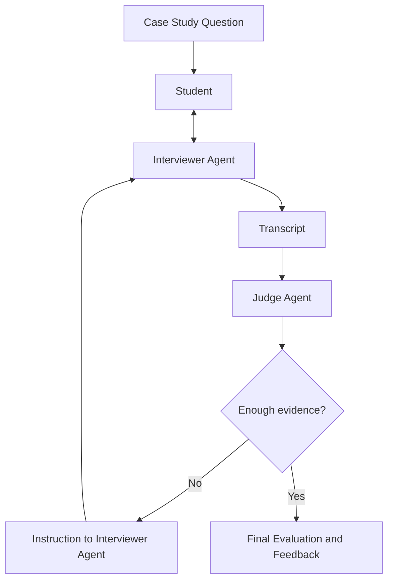
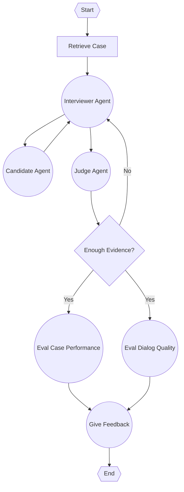
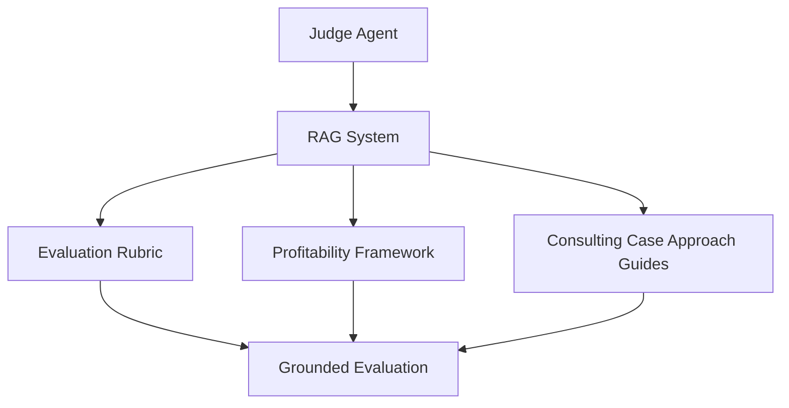

# System Architecture Explanation

## 1. Overview

The proposed system is an AI-based platform for simulating consulting case interviews and generating automatic feedback on a student's performance. The project compares two different architectures:

1. **Baseline system**: a single-agent system that manages the whole interaction.
2. **Agentic system**: a multi-agent architecture where different agents have specialised responsibilities and coordinate during the interview.

The purpose of this comparison is to evaluate whether an agentic architecture provides better assessment and feedback than a simpler single-agent baseline.


## 2. Main Goal of the System

In consulting case interview, the student receives a business problem, asks questions, analyses information, performs calculations when needed, and proposes a final recommendation.

The system does not only check whether the final answer is correct. Instead, it evaluates the quality of the student's reasoning process, including:

- problem structuring;
- business logic;
- quantitative reasoning;
- use of assumptions;
- communication clarity;
- final recommendation quality.

> Note: consulting case interviews usually do not have a single correct answer.


## 3. High-Level Architecture

At a high level, the system starts from a case study question and interacts with the student through an interview flow. The student's answers are stored as a transcript, which becomes the main evidence used for evaluation.

The architecture contains two alternative execution modes:



The baseline system is used as a reference point. The agentic system is the proposed improvement, because it separates the responsibilities of interviewing and judging.


## 4. Baseline System

This agent is responsible for the full interview cycle:

1. Presenting or managing the case interview;
2. Interacting with the student;
3. Applying the evaluation rubric;
4. Assigning a score or grade;
5. Generating feedback at the end of the interaction.



If both systems perform similarly, then the added complexity of multiple agents may not be justified. If the agentic system provides more accurate, specific, or useful feedback, then the architecture has a stronger justification.


## 5. Agentic System

The agentic system is composed of two specialised agents:

1. Interviewer Agent
2. Judge Agent

These agents interact during the interview. The interviewer agent speaks directly with the student, while the judge agent analyses the conversation and decides whether more evidence is needed.



The key difference from the baseline is that the interview is not only driven by one agent. Instead, the judge agent can guide the interviewer agent towards areas that need further exploration.

## 5.1 Agentic 02 Interview Graph

This alternative graph shows the detailed control flow for the agentic interview system, including case retrieval, the interviewer-candidate loop, the judge decision, and the final split between case-performance evaluation and dialog-quality evaluation.



The process begins with the `Start` node. The system first retrieves the consulting case that will be used in the simulated interview.

After the case is retrieved, the `Interviewer Agent` starts the interaction. This agent is responsible for presenting the case, asking questions, and guiding the interview.

The `Candidate Agent` responds to the interviewer. The interaction between the `Interviewer Agent` and the `Candidate Agent` is iterative: the interviewer asks questions, the candidate answers, and the interviewer continues probing the candidate's reasoning.

The `Judge Agent` observes or receives the information generated during the interview. Its role is to assess whether the conversation contains enough evidence to evaluate the candidate properly.

The decision node `Enough Evidence?` controls whether the interview should continue.

If the answer is `No`, the system returns to the `Interviewer Agent`, which asks further questions to gather more evidence.

If the answer is `Yes`, the system moves to the evaluation stage. Two types of evaluation are performed:

- `Eval Case Performance`: evaluates the candidate's case-solving ability, including structure, business logic, quantitative reasoning, assumptions, and final recommendation.
- `Eval Dialog Quality`: evaluates the quality of the interaction, including clarity, coherence, responsiveness, repetition, confidence level, and communication issues.

Both evaluation outputs are then combined in the `Give Feedback` node. Finally, the system ends once feedback has been generated.


## 6. Interviewer Agent

The Interviewer Agent is responsible for conducting the interview with the student. Its main tasks are:

- presenting the case;
- asking initial questions;
- asking adaptive follow-up questions;
- encouraging structured reasoning;
- encouraging critical thinking;
- keeping the conversation close to a real consulting case interview.

The interviewer agent should not immediately give away the answer. Its role is to help reveal the student's reasoning by asking targeted questions. 

In the diagram, this agent is also connected to a small fine-tuning component based on Socratic questions. The purpose of this is to make the interviewer better at asking questions that guide the student without directly solving the case for them.


## 7. Judge Agent

The Judge Agent is responsible for evaluating the interaction. It analyses the full transcript and evaluates the student's performance against a rubric.

Its main tasks are:

- reading the full interaction;
- checking the rubric dimensions;
- identifying strengths and weaknesses;
- deciding whether there is enough evidence to evaluate the student;
- guiding the interviewer agent when more information is needed;
- producing or supporting the final evaluation.

The judge agent uses an LLM to assess open-ended student responses according to explicit criteria. This is useful because consulting cases involve qualitative reasoning, assumptions, business judgement, and communication, not only numerical answers.


## 8. Transcript as Shared State

The transcript stores the conversation between the student and the interviewer agent.It acts as shared evidence for the judge agent. Instead of evaluating isolated answers, the judge can evaluate the full reasoning process across the interview.

A simplified transcript structure could look like this:

```json
{
  "run_id": "run_001",
  "scenario_id": "case_001",
  "system_type": "agentic",
  "transcript": [
    {
      "turn": 1,
      "speaker": "interviewer_agent",
      "message": "Your client is a fast-food restaurant that has been losing money..."
    },
    {
      "turn": 2,
      "speaker": "student",
      "message": "I would first split the problem into revenue and costs."
    }
  ]
}
```

This structure makes the system easier to evaluate because the same case and the same student response can be tested with both the baseline and the agentic system.


## 9. RAG System

The agentic architecture includes a Retrieval-Augmented Generation component. The RAG system gives the judge agent access to external documents related to consulting case interview preparation.

The RAG system will retrieve:
- Evaluation rubric;
- Harvard profitability framework;
- Harvard guidance on how to approach consulting cases.

The purpose of RAG is to ground the judge's evaluation in external case interview knowledge. Instead of relying only on the LLM's internal knowledge, the system can retrieve relevant material about how consulting cases should be structured and evaluated.




## 10. Evaluation Rubric

The evaluation rubric provides the criteria used by the judge agent to assess performance. A possible rubric includes the following dimensions:

| Dimension | What it evaluates |
|---|---|
| Case opening | Whether the student clarifies the objective and understands the problem. |
| Case structure | Whether the student uses a logical and relevant framework. |
| Case math | Whether the student performs calculations correctly and interprets them properly. |
| Business judgement | Whether the student makes reasonable assumptions and prioritises relevant drivers. |
| Creativity | Whether the student considers non-obvious but plausible ideas. |
| Final recommendation | Whether the student gives a clear, justified, and actionable recommendation. |
| Overall | General performance across the full interaction. |


## 11. Final Feedback Generation

At the end of the interview, the system generates feedback for the student. The feedback should be specific, actionable, and connected to the transcript.

A good feedback report should include:

- a short overall assessment;
- scores by rubric dimension;
- concrete strengths;
- concrete weaknesses;
- examples from the student's answers;
- recommendations for improvement;
- possible next practice focus.

For example, instead of saying:

> Your structure was weak.

The feedback should say:

> You correctly identified revenue and costs as the two main profitability drivers, but you did not break revenue into price and volume. In future profitability cases, start by building a complete issue tree before moving into calculations.

This makes the feedback more useful for learning.


## 12. Why the System Is Agentic

The sistem is agentic because the agents have different responsibilities, maintain state, and coordinate their own flow (decided by them), to achieve a common goal (interviewing and evaluating the student). The agents are not just tools that follow instructions, but active participants in the process.

## 13. Baseline vs Agentic System

| Aspect | Baseline System | Agentic System |
|---|---|---|
| Number of agents | One | Two specialised agents |
| Interview management | Baseline agent | Interviewer agent |
| Evaluation | Same baseline agent | Judge agent |
| Feedback | Same baseline agent | Judge agent, supported by transcript and RAG |
| Adaptiveness | Limited | Higher, because the judge can guide follow-ups |
| Complexity | Lower | Higher |
| Purpose | Reference system | Proposed architecture |


## 14. Expected Benefits

The expected benefits of the agentic system are:

- more targeted follow-up questions;
- better evidence collection during the interview;
- more consistent use of the rubric;
- more grounded feedback through RAG;
- clearer separation between interviewing and evaluation;
- better simulation of a real consulting case interview.

However, the agentic system also introduces additional complexity. It requires coordination between agents, careful state management, and clear stopping criteria for deciding when enough evidence has been collected.


## 15. Summary

The system compares a simple baseline agent with a more specialised agentic architecture for consulting case interview simulation. The baseline agent manages the entire process alone, while the agentic system separates the interview and evaluation responsibilities between an interviewer agent and a judge agent.

The interviewer agent interacts with the student and asks adaptive questions. The judge agent evaluates the transcript, applies the rubric, checks whether enough evidence has been collected, and uses RAG-based consulting case knowledge to support the final feedback.

This architecture is designed to test whether agent coordination improves the quality of automated consulting case interview assessment and feedback.
